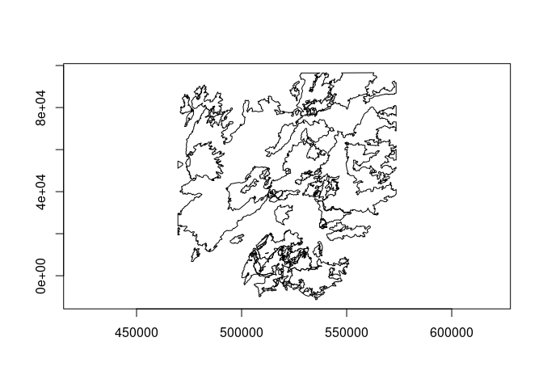
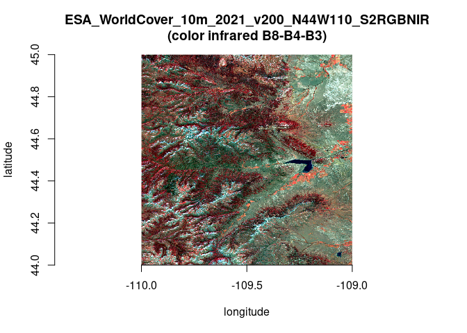

# Draft Bindings to the GDAL/OGR Vector API

**Note**: This document is now out of date and retained only as a record
of the original proposed interface and initial development. Bindings to
the GDAL Vector API were added in the **gdalraster** [2.0.0
release](https://github.com/firelab/gdalraster/releases/tag/v.2.0.0).
For current specifications, see the package vignette [Vector API
Overview](https://firelab.github.io/gdalraster/articles/vector-api-overview.html)
and the documentation for class
[`GDALVector`](https://firelab.github.io/gdalraster/reference/GDALVector-class.html).

Chris Toney (chris.toney at usda.gov)

Last modified: 2024-09-14

Comment/discussion: <https://github.com/firelab/gdalraster/issues/241>

## Summary

This document describes R bindings to the GDAL/OGR Vector API proposed
for inclusion in package **gdalraster**, analogous to its existing
raster support. A package providing low-level access to both the raster
and vector APIs in GDAL should be of interest to developers creating
higher level interfaces. For example, custom workflows that are I/O
intensive may benefit from direct access to GDAL’s I/O capabilities. R
bindings to the vector API would support persistent connections to the
data store, cursors with attribute and spatial filtering, transactions,
feature-level insert/delete, update of attributes and geometries, and
OGR facilities for geoprocessing. Calling signatures of a class-based
interface will resemble the C++ and Python APIs provided by the GDAL
project. It is intended that bindings in **gdalraster** should provide
long-term API stability while tracking changes in GDAL.

A proposed interface is described in terms of the [GDAL Vector Data
Model](https://gdal.org/en/stable/user/vector_data_model.html), along
with a draft class definition for implementation via
`RCPP_EXPOSED_CLASS`.

An initial implemetation supporting read access has been merged into the
**gdalraster** main branch (as of v. 1.11.1.9100, 2024-07-23), with
online documentation available at:
<https://firelab.github.io/gdalraster/reference/GDALVector-class.html>

## Description of the interface

Bindings will be implemented with **Rcpp** modules including
`RCPP_EXPOSED_CLASS`. Exposing C++ classes directly in R provides a
natural interface to the underlying object model.

### Vector dataset

A GDAL Dataset for vector is a file or database containing one or more
OGR layers. A vector dataset is represented in R as a data source name
(DSN), a character string that may be a filename, database connection
string, URL, virtual file, etc. Management of datasets and their vector
schemas will be done with:

- existing management functions in **gdalraster** that operate on vector
  datasets:
  [`copyDatasetFiles()`](https://firelab.github.io/gdalraster/reference/copyDatasetFiles.md),
  [`deleteDataset()`](https://firelab.github.io/gdalraster/reference/deleteDataset.md),
  [`renameDataset()`](https://firelab.github.io/gdalraster/reference/renameDataset.md)
  and
  [`addFilesInZip()`](https://firelab.github.io/gdalraster/reference/addFilesInZip.md)
  (supports SOZip)
- existing utility functions for managing vector data sources (as of
  **gdalraster** 1.11.0):
  [ogr_manage](https://firelab.github.io/gdalraster/reference/ogr_manage.html)
  and
  [ogr_define](https://firelab.github.io/gdalraster/reference/ogr_define.html)
- existing wrappers
  [`ogr2ogr()`](https://firelab.github.io/gdalraster/reference/ogr2ogr.md)
  and
  [`ogrinfo()`](https://firelab.github.io/gdalraster/reference/ogrinfo.md)
  from the GDAL Utils API (as of **gdalraster** 1.10.0)
- [`ogr_execute_sql()`](https://firelab.github.io/gdalraster/reference/ogr_manage.md):
  execute an SQL statement against the data store to edit data (a SQL
  `SELECT` statement can be used in the constructor for class
  `GDALVector` described below, to open a layer of features)

### Vector layer

The OGR Layer class represents a layer of features within a data source.
It will be modeled in R as class `GDALVector`, an exposed C++ class
encapsulating an OGR Layer and the GDAL Dataset that owns it. A
`GDALVector` object will persist an open connection to the dataset, and
expose methods for retrieving layer information, setting attribute and
spatial filters, reading/writing features, and layer geoprocessing. A
draft definition for class `GDALVector` is given below.

### Feature class / field definitions

All features in an OGR Layer share a common schema (feature class)
modeled in GDAL as OGR Feature Definition. A feature class definition
includes the set of attribute fields and their data types, the geometry
field(s), and a feature class name (normally used as a layer name). The
feature class definition is represented as a list in R, having as names
the attribute/geometry field names, with each list element holding a
field definition.

An attribute field definition is a list with named elements:

    $type       : OGR Field Type ("OFTString", "OFTInteger", ...)
    $subtype    : optional ("OFSTBoolean", ...)
    $width      : optional max number of characters
    $precision  : optional number of digits after the decimal point
    $is_nullable: optional NOT NULL constraint (logical scalar)
    $is_unique  : optional UNIQUE constraint (logical scalar)
    $default    : optional field default value as character string
    $domain     : optional domain name
    $is_geom    : FALSE for attribute fields

A geometry field definition is a list with named elements:

    $type       : geom type ("Point", "Polygon", etc.)
    $srs        : optional spatial reference as WKT string
    $is_nullable: optional NOT NULL constraint (logical scalar)
    $is_geom    : TRUE for geometry fields

### Feature retrieval

An OGR Feature – as read by `GDALVector::getNextFeature()` or
`GDALVector::getFeature()`, or as passed to write methods – is a list
with the unique feature identifier (FID), the attribute and geometry
field names, and their values.

`GDALVector::fetch()` fetches the next `n` features from the layer and
returns them as a data frame (analog of
[`DBI::dbFetch()`](https://dbi.r-dbi.org/reference/dbFetch.html)). This
allows retrieving the entire feature set (potentially with an attribute
and/or spatial filter applied), one page of features at a time, or the
remaining features. `fetch()` can be called multiple times (forward
paging). Fetching zero features is also possible to retrieve the
structure of the result set as a data frame.

OGR field types are returned as the corresponding native R types (`NA`
for OGR NULL values):

- `OFTInteger`: `integer` (subtype `OFSTBoolean` as `logical`)
- `OFTIntegerList`: vector of `integer` (list column in data frames)
- `OFTInteger64`:
  [`bit64::integer64`](https://rdrr.io/pkg/bit64/man/bit64-package.html)
  (subtype `OFSTBoolean` as `logical`)
- `OFTInteger64List`: vector of
  [`bit64::integer64`](https://rdrr.io/pkg/bit64/man/bit64-package.html)
  (list column in data frames)
- `OFTReal`: `numeric`
- `OFTRealList`: vector of `numeric` (list column in data frames)
- `OFTString`: `character` string
- `OFTStringList`: vector of `character` strings (list column in data
  frames)
- `OFTDate`: `Date`
- `OFTDateTime`: `POSIXct` (millisecond accuracy, adjustment for time
  zone flag if present)
- `OFTBinary`: `raw` vector (list column in data frames)

### Geometry

An OGR Geometry can be represented in R as either a character string
containing OGC Well Known Text (WKT), or a raw vector of bytes
containing Well Known Binary (WKB). An OGR Spatial Reference, which
encapsulates the definition of a projection and datum, is represented in
R as WKT. **gdalraster** has existing functions for working with spatial
reference systems as WKT
([`srs_to_wkt()`](https://firelab.github.io/gdalraster/reference/srs_convert.md),
[`srs_is_projected()`](https://firelab.github.io/gdalraster/reference/srs_query.md),
etc.), and a set of geometry convenience functions also operating on WKT
(GEOS via GDAL headers).

Package [wk](https://github.com/paleolimbot/wk) supports parsing WKB and
WKT representation of geometries to and from R-native formats.
Interoperability with [sf](https://github.com/r-spatial/sf) classes for
simple features is also straightforward (e.g., `sf::st_sf()`).

Returning geometries is optional when retrieving features from a data
store with **gdalraster**. Omitting the geometries can improve
performance and memory utilization when access only to the attributes is
needed (currently the default). When geometries are included, they can
be retrieved as either WKB or WKT (optionally as the ISO versions). WKB
is compact and fast to parse, e.g., using the high performance functions
provided by **wk**. The setting for geometry retrieval is per-object for
class `GDALvector`, and can be set back and forth as needed during the
lifetime of the object.

## class GDALVector

The draft class definition below has been partially implemented in:

<https://github.com/firelab/gdalraster/blob/gdalvector/src/gdalvector.cpp>

The header file can be referenced for the public class methods that have
been implemented so far in the prototype (a subset of the draft class
definition below):

<https://github.com/firelab/gdalraster/blob/gdalvector/src/gdalvector.h>

``` cpp
class GDALVector {
 public:
    GDALVector();
    explicit GDALVector(Rcpp::CharacterVector dsn);
    GDALVector(Rcpp::CharacterVector dsn, std::string layer);
    GDALVector(Rcpp::CharacterVector dsn, std::string layer, bool read_only);
    GDALVector(Rcpp::CharacterVector dsn, std::string layer, bool read_only,
               Rcpp::CharacterVector open_options);
    GDALVector(Rcpp::CharacterVector dsn, std::string layer, bool read_only,
               Rcpp::Nullable<Rcpp::CharacterVector> open_options,
               std::string spatial_filter, std::string dialect);

    // undocumented, exposed read-only fields for internal use
    std::string m_layer_name {""};  // layer name or sql statement
    bool m_is_sql {false};
    std::string m_dialect {""};

    // exposed read/write fields
    std::string defaultGeomFldName {"geometry"};
    bool promoteToMulti {false};
    std::string returnGeomAs {"WKB"};
    std::string wkbByteOrder {"LSB"};

    // exposed methods
    void open(bool read_only);
    bool isOpen() const;
    std::string getDsn() const;
    Rcpp::CharacterVector getFileList() const;
    std::string getDriverShortName() const;
    std::string getDriverLongName() const;

    std::string getName() const;
    Rcpp::CharacterVector getFieldNames() const;
    Rcpp::List testCapability() const;
    std::string getFIDColumn() const;
    std::string getGeomType() const;
    std::string getGeometryColumn() const;
    std::string getSpatialRef() const;
    Rcpp::NumericVector bbox();
    Rcpp::List getLayerDefn() const;

    void setAttributeFilter(const std::string &query);
    std::string getAttributeFilter() const;
    void setIgnoredFields(const Rcpp::RObject &fields);
    void setSelectedFields(const Rcpp::RObject &fields);

    void setSpatialFilter(const std::string &wkt);
    void setSpatialFilterRect(const Rcpp::RObject &bbox);
    std::string getSpatialFilter() const;
    void clearSpatialFilter();

    double getFeatureCount();
    SEXP getNextFeature();
    void setNextByIndex(double i);
    // fid must be a length-1 numeric vector, since numeric vector can carry
    // the class attribute for integer64:
    SEXP getFeature(const Rcpp::RObject &fid);
    void resetReading();

    Rcpp::DataFrame fetch(double n);

    bool setFeature(const Rcpp::RObject &feature);
    bool createFeature(const Rcpp::RObject &feature);
    bool upsertFeature(const Rcpp::RObject &feature);
    SEXP getLastWriteFID() const;
    bool deleteFeature(const Rcpp::RObject &fid);
    bool syncToDisk() const;

    bool startTransaction(bool force);
    bool commitTransaction();
    bool rollbackTransaction();

    bool layerIntersection(
            GDALVector method_layer,
            GDALVector result_layer,
            bool quiet,
            const Rcpp::Nullable<const Rcpp::CharacterVector> &options);
    bool layerUnion(
            GDALVector method_layer,
            GDALVector result_layer,
            bool quiet,
            const Rcpp::Nullable<const Rcpp::CharacterVector> &options);
    bool layerSymDifference(
            GDALVector method_layer,
            GDALVector result_layer,
            bool quiet,
            const Rcpp::Nullable<const Rcpp::CharacterVector> &options);
    bool layerIdentity(
            GDALVector method_layer,
            GDALVector result_layer,
            bool quiet,
            const Rcpp::Nullable<const Rcpp::CharacterVector> &options);
    bool layerUpdate(
            GDALVector method_layer,
            GDALVector result_layer,
            bool quiet,
            const Rcpp::Nullable<const Rcpp::CharacterVector> &options);
    bool layerClip(
            GDALVector method_layer,
            GDALVector result_layer,
            bool quiet,
            const Rcpp::Nullable<const Rcpp::CharacterVector> &options);
    bool layerErase(
            GDALVector method_layer,
            GDALVector result_layer,
            bool quiet,
            const Rcpp::Nullable<const Rcpp::CharacterVector> &options);

    void close();

    void OGRFeatureFromList_dumpReadble(const Rcpp::RObject &feat) const;

    // methods for internal use not exposed to R
    void checkAccess_(GDALAccess access_needed) const;
    void setDsn_(std::string dsn);
    GDALDatasetH getGDALDatasetH_() const;
    void setGDALDatasetH_(const GDALDatasetH hDs, bool with_update);
    OGRLayerH getOGRLayerH_() const;
    void setOGRLayerH_(const OGRLayerH hLyr, const std::string &lyr_name);
    void setFieldNames_();
    SEXP initDF_(R_xlen_t nrow) const;
    OGRFeatureH OGRFeatureFromList_(const Rcpp::RObject &feature) const;

 private:
    std::string m_dsn {""};
    Rcpp::CharacterVector m_open_options {};
    std::string m_attr_filter {""};
    std::string m_spatial_filter {""};
    Rcpp::CharacterVector m_field_names {};
    Rcpp::CharacterVector m_ignored_fields {};
    GDALDatasetH m_hDataset {nullptr};
    GDALAccess m_eAccess {GA_ReadOnly};
    OGRLayerH m_hLayer {nullptr};
    int64_t m_last_write_fid {NA_INTEGER64};
};

RCPP_EXPOSED_CLASS(GDALVector)
```

## Example: usage for class GDALVector

``` r
## usage for GDALVector class

library(gdalraster)
#> GDAL 3.8.4, released 2024/02/08, GEOS 3.12.1, PROJ 9.3.1

# MTBS fires in Yellowstone National Park 1984-2022
f <- system.file("extdata/ynp_fires_1984_2022.gpkg", package="gdalraster")
# copy to a temporary in-memory file that is writeable
dsn <- paste0("/vsimem/", basename(f))
vsi_copy_file(f, dsn)
#> [1] 0

lyr <- new(GDALVector, dsn, "mtbs_perims")

# object of class GDALVector
lyr
#> C++ object <0x58bb870345b0> of class 'GDALVector' <0x58bb8825b400>
str(lyr)
#> Reference class 'Rcpp_GDALVector' [package "gdalraster"] with 3 fields
#>  $ defaultGeomFldName: chr "geometry"
#>  $ returnGeomAs      : chr "NONE"
#>  $ wkbByteOrder      : chr "LSB"
#>  and 46 methods, of which 32 are  possibly relevant:
#>    bbox, clearSpatialFilter, close, fetch, finalize, getDriverLongName,
#>    getDriverShortName, getDsn, getFeature, getFeatureCount, getFIDColumn,
#>    getFileList, getGeometryColumn, getGeomType, getLayerDefn, getName,
#>    getNextFeature, getSpatialRef, initialize, isOpen, layerClip, layerErase,
#>    layerIdentity, layerIntersection, layerSymDifference, layerUnion,
#>    layerUpdate, open, resetReading, setAttributeFilter, setSpatialFilterRect,
#>    testCapability

# dataset info
lyr$getDriverShortName()
#> [1] "GPKG"
lyr$getDriverLongName()
#> [1] "GeoPackage"
lyr$getFileList()
#> [1] "/vsimem/ynp_fires_1984_2022.gpkg"

# layer info
lyr$getName()
#> [1] "mtbs_perims"
lyr$getGeomType()
#> [1] "MULTIPOLYGON"
lyr$getGeometryColumn()
#> [1] "geom"
lyr$getFIDColumn()
#> [1] "fid"
lyr$getSpatialRef()
#> [1] "PROJCS[\"NAD83 / Montana\",GEOGCS[\"NAD83\",DATUM[\"North_American_Datum_1983\",SPHEROID[\"GRS 1980\",6378137,298.257222101,AUTHORITY[\"EPSG\",\"7019\"]],AUTHORITY[\"EPSG\",\"6269\"]],PRIMEM[\"Greenwich\",0,AUTHORITY[\"EPSG\",\"8901\"]],UNIT[\"degree\",0.0174532925199433,AUTHORITY[\"EPSG\",\"9122\"]],AUTHORITY[\"EPSG\",\"4269\"]],PROJECTION[\"Lambert_Conformal_Conic_2SP\"],PARAMETER[\"latitude_of_origin\",44.25],PARAMETER[\"central_meridian\",-109.5],PARAMETER[\"standard_parallel_1\",49],PARAMETER[\"standard_parallel_2\",45],PARAMETER[\"false_easting\",600000],PARAMETER[\"false_northing\",0],UNIT[\"metre\",1,AUTHORITY[\"EPSG\",\"9001\"]],AXIS[\"Easting\",EAST],AXIS[\"Northing\",NORTH],AUTHORITY[\"EPSG\",\"32100\"]]"
lyr$bbox()
#> [1] 469685.73 -12917.76 573531.72  96577.34

# layer capabilities
lyr$testCapability()
#> $RandomRead
#> [1] TRUE
#> 
#> $SequentialWrite
#> [1] FALSE
#> 
#> $RandomWrite
#> [1] FALSE
#> 
#> $UpsertFeature
#> [1] FALSE
#> 
#> $FastSpatialFilter
#> [1] TRUE
#> 
#> $FastFeatureCount
#> [1] TRUE
#> 
#> $FastGetExtent
#> [1] TRUE
#> 
#> $FastSetNextByIndex
#> [1] TRUE
#> 
#> $CreateField
#> [1] FALSE
#> 
#> $CreateGeomField
#> [1] FALSE
#> 
#> $DeleteField
#> [1] FALSE
#> 
#> $ReorderFields
#> [1] FALSE
#> 
#> $AlterFieldDefn
#> [1] FALSE
#> 
#> $AlterGeomFieldDefn
#> [1] FALSE
#> 
#> $DeleteFeature
#> [1] FALSE
#> 
#> $StringsAsUTF8
#> [1] TRUE
#> 
#> $Transactions
#> [1] TRUE
#> 
#> $CurveGeometries
#> [1] TRUE

# re-open with write access
lyr$open(read_only = FALSE)
lyr$testCapability()$SequentialWrite
#> [1] TRUE
lyr$testCapability()$RandomWrite
#> [1] TRUE

# feature class definition - a list of fields and their definitions
defn <- lyr$getLayerDefn()
names(defn)
#>  [1] "event_id"     "incid_name"   "incid_type"   "map_id"       "burn_bnd_ac" 
#>  [6] "burn_bnd_lat" "burn_bnd_lon" "ig_date"      "ig_year"      "geom"

# each list element holds a field definition list
str(defn)
#> List of 10
#>  $ event_id    :List of 9
#>   ..$ type       : chr "OFTString"
#>   ..$ subtype    : chr "OFSTNone"
#>   ..$ width      : int 254
#>   ..$ precision  : int 0
#>   ..$ is_nullable: logi TRUE
#>   ..$ is_unique  : logi FALSE
#>   ..$ default    : chr ""
#>   ..$ is_geom    : logi FALSE
#>  $ incid_name  :List of 9
#>   ..$ type       : chr "OFTString"
#>   ..$ subtype    : chr "OFSTNone"
#>   ..$ width      : int 254
#>   ..$ precision  : int 0
#>   ..$ is_nullable: logi TRUE
#>   ..$ is_unique  : logi FALSE
#>   ..$ default    : chr ""
#>   ..$ is_geom    : logi FALSE
#>  $ incid_type  :List of 9
#>   ..$ type       : chr "OFTString"
#>   ..$ subtype    : chr "OFSTNone"
#>   ..$ width      : int 254
#>   ..$ precision  : int 0
#>   ..$ is_nullable: logi TRUE
#>   ..$ is_unique  : logi FALSE
#>   ..$ default    : chr ""
#>   ..$ is_geom    : logi FALSE
#>  $ map_id      :List of 9
#>   ..$ type       : chr "OFTInteger64"
#>   ..$ subtype    : chr "OFSTNone"
#>   ..$ width      : int 0
#>   ..$ precision  : int 0
#>   ..$ is_nullable: logi TRUE
#>   ..$ is_unique  : logi FALSE
#>   ..$ default    : chr ""
#>   ..$ is_geom    : logi FALSE
#>  $ burn_bnd_ac :List of 9
#>   ..$ type       : chr "OFTInteger64"
#>   ..$ subtype    : chr "OFSTNone"
#>   ..$ width      : int 0
#>   ..$ precision  : int 0
#>   ..$ is_nullable: logi TRUE
#>   ..$ is_unique  : logi FALSE
#>   ..$ default    : chr ""
#>   ..$ is_geom    : logi FALSE
#>  $ burn_bnd_lat:List of 9
#>   ..$ type       : chr "OFTString"
#>   ..$ subtype    : chr "OFSTNone"
#>   ..$ width      : int 10
#>   ..$ precision  : int 0
#>   ..$ is_nullable: logi TRUE
#>   ..$ is_unique  : logi FALSE
#>   ..$ default    : chr ""
#>   ..$ is_geom    : logi FALSE
#>  $ burn_bnd_lon:List of 9
#>   ..$ type       : chr "OFTString"
#>   ..$ subtype    : chr "OFSTNone"
#>   ..$ width      : int 10
#>   ..$ precision  : int 0
#>   ..$ is_nullable: logi TRUE
#>   ..$ is_unique  : logi FALSE
#>   ..$ default    : chr ""
#>   ..$ is_geom    : logi FALSE
#>  $ ig_date     :List of 9
#>   ..$ type       : chr "OFTDate"
#>   ..$ subtype    : chr "OFSTNone"
#>   ..$ width      : int 0
#>   ..$ precision  : int 0
#>   ..$ is_nullable: logi TRUE
#>   ..$ is_unique  : logi FALSE
#>   ..$ default    : chr ""
#>   ..$ is_geom    : logi FALSE
#>  $ ig_year     :List of 9
#>   ..$ type       : chr "OFTInteger"
#>   ..$ subtype    : chr "OFSTNone"
#>   ..$ width      : int 0
#>   ..$ precision  : int 0
#>   ..$ is_nullable: logi TRUE
#>   ..$ is_unique  : logi FALSE
#>   ..$ default    : chr ""
#>   ..$ is_geom    : logi FALSE
#>  $ geom        :List of 5
#>   ..$ type       : chr "MULTIPOLYGON"
#>   ..$ srs        : chr "PROJCS[\"NAD83 / Montana\",GEOGCS[\"NAD83\",DATUM[\"North_American_Datum_1983\",SPHEROID[\"GRS 1980\",6378137,2"| __truncated__
#>   ..$ is_nullable: logi TRUE
#>   ..$ is_geom    : logi TRUE

lyr$getFeatureCount()
#> [1] 61

# cursor
feat <- lyr$getNextFeature()
# a list of field names and their values
str(feat)
#> List of 10
#>  $ FID         :integer64 1 
#>  $ event_id    : chr "WY4413411069519870807"
#>  $ incid_name  : chr "POLECAT"
#>  $ incid_type  : chr "Wildfire"
#>  $ map_id      :integer64 10015934 
#>  $ burn_bnd_ac :integer64 1093 
#>  $ burn_bnd_lat: chr "44.132"
#>  $ burn_bnd_lon: chr "-110.696"
#>  $ ig_date     : Date[1:1], format: "1987-08-07"
#>  $ ig_year     : int 1987

# attribute filter
lyr$setAttributeFilter("ig_year = 2020")
lyr$getFeatureCount()
#> [1] 1

# default value of read/write field 'returnGeomAs'
lyr$returnGeomAs
#> [1] "NONE"

feat <- lyr$getNextFeature()
str(feat)
#> List of 10
#>  $ FID         :integer64 61 
#>  $ event_id    : chr "WY4438911082120200822"
#>  $ incid_name  : chr "LONE STAR"
#>  $ incid_type  : chr "Wildfire"
#>  $ map_id      :integer64 10020495 
#>  $ burn_bnd_ac :integer64 3348 
#>  $ burn_bnd_lat: chr "44.4"
#>  $ burn_bnd_lon: chr "-110.782"
#>  $ ig_date     : Date[1:1], format: "2020-08-22"
#>  $ ig_year     : int 2020

# NULL if no more features are available
feat <- lyr$getNextFeature()
str(feat)
#>  NULL

# reset reading to the start and return geometry as WKT
lyr$resetReading()
lyr$returnGeomAs <- "WKT"
feat <- lyr$getNextFeature()
str(feat)
#> List of 11
#>  $ FID         :integer64 61 
#>  $ event_id    : chr "WY4438911082120200822"
#>  $ incid_name  : chr "LONE STAR"
#>  $ incid_type  : chr "Wildfire"
#>  $ map_id      :integer64 10020495 
#>  $ burn_bnd_ac :integer64 3348 
#>  $ burn_bnd_lat: chr "44.4"
#>  $ burn_bnd_lon: chr "-110.782"
#>  $ ig_date     : Date[1:1], format: "2020-08-22"
#>  $ ig_year     : int 2020
#>  $ geom        : chr "MULTIPOLYGON (((496593.122306971 15506.8828590633,496491.761299067 15605.3612548792,496290.812130161 15388.0465"| __truncated__

# clear attribute filter
lyr$setAttributeFilter("")
lyr$getFeatureCount()
#> [1] 61

# spatial filter
# get the bounding box of the largest 1988 fire and use as spatial filter
# first set a temporary attribute filter to do the lookup
lyr$setAttributeFilter("ig_year = 1988 ORDER BY burn_bnd_ac DESC")
feat <- lyr$getNextFeature()
str(feat)
#> List of 11
#>  $ FID         :integer64 7 
#>  $ event_id    : chr "WY4470811082119880722"
#>  $ incid_name  : chr "NORTH FORK"
#>  $ incid_type  : chr "Wildfire"
#>  $ map_id      :integer64 10014217 
#>  $ burn_bnd_ac :integer64 563527 
#>  $ burn_bnd_lat: chr "44.678"
#>  $ burn_bnd_lon: chr "-110.716"
#>  $ ig_date     : Date[1:1], format: "1988-07-22"
#>  $ ig_year     : int 1988
#>  $ geom        : chr "MULTIPOLYGON (((469685.969312071 29526.2354109807,469918.933844832 29654.3220754602,470030.299119989 29518.7441"| __truncated__

bbox <- bbox_from_wkt(feat$geom)
print(bbox)
#> [1] 469685.97  11442.45 544069.63  85508.15

# set spatial filter on the full layer
lyr$setAttributeFilter("")
lyr$setSpatialFilterRect(bbox)
lyr$getFeatureCount()
#> [1] 40

# fetch n features at a time and return as a data frame
# analog of DBI::dbFetch() where the lyr object is a result set
# geometry can optionally be returned as NONE, WKT or WKB
d <- lyr$fetch(20)
str(d)
#> 'data.frame':    20 obs. of  11 variables:
#>  $ FID         :integer64 38 7 32 25 6 40 36 8 ... 
#>  $ event_id    : chr  "MT4471311115120070627" "WY4470811082119880722" "MT4491211108020030820" "WY4433011103020000816" ...
#>  $ incid_name  : chr  "MADISON ARM" "NORTH FORK" "RATHBONE" "SPRUCE COMPLEX (PLATEAU)" ...
#>  $ incid_type  : chr  "Wildfire" "Wildfire" "Wildfire" "Wildfire" ...
#>  $ map_id      :integer64 16113 10014217 13014 10014141 10014215 16428 15432 10014218 ... 
#>  $ burn_bnd_ac :integer64 3564 563527 2701 2808 20422 2175 3745 95233 ... 
#>  $ burn_bnd_lat: chr  "44.713" "44.678" "44.912" "44.329" ...
#>  $ burn_bnd_lon: chr  "-111.151" "-110.716" "-111.080" "-111.027" ...
#>  $ ig_date     : Date, format: "2007-06-27" "1988-07-22" ...
#>  $ ig_year     : int  2007 1988 2003 2000 1988 2007 2006 1988 1988 1988 ...
#>  $ geom        : chr  "MULTIPOLYGON (((469685.969631834 54506.9481370259,470235.509134591 54383.4837249131,470939.42854159 53898.69574"| __truncated__ "MULTIPOLYGON (((469685.969312071 29526.2354109807,469918.933844832 29654.3220754602,470030.299119989 29518.7441"| __truncated__ "MULTIPOLYGON (((475136.766856355 74053.2153491452,475188.847231864 74366.3342955356,475341.959781024 74368.4856"| __truncated__ "MULTIPOLYGON (((477992.723214764 8483.08443989834,477312.456870818 7630.95433906866,477088.305832492 6955.09786"| __truncated__ ...

# the next 20 features
d <- lyr$fetch(20)
nrow(d)
#> [1] 20

# no features remaining
d <- lyr$fetch(20)
nrow(d)
#> [1] 0
str(d)  # 0-row data frame with columns typed
#> 'data.frame':    0 obs. of  11 variables:
#>  $ FID         :integer64  
#>  $ event_id    : chr 
#>  $ incid_name  : chr 
#>  $ incid_type  : chr 
#>  $ map_id      :integer64  
#>  $ burn_bnd_ac :integer64  
#>  $ burn_bnd_lat: chr 
#>  $ burn_bnd_lon: chr 
#>  $ ig_date     : 'Date' num(0) 
#>  $ ig_year     : int 
#>  $ geom        : chr

# fetch all available features by passing n = -1, resets to first feature
# return geom as a list column of WKB raw vectors
lyr$returnGeomAs <- "WKB"
d <- lyr$fetch(-1)
str(d)
#> 'data.frame':    40 obs. of  11 variables:
#>  $ FID         :integer64 38 7 32 25 6 40 36 8 ... 
#>  $ event_id    : chr  "MT4471311115120070627" "WY4470811082119880722" "MT4491211108020030820" "WY4433011103020000816" ...
#>  $ incid_name  : chr  "MADISON ARM" "NORTH FORK" "RATHBONE" "SPRUCE COMPLEX (PLATEAU)" ...
#>  $ incid_type  : chr  "Wildfire" "Wildfire" "Wildfire" "Wildfire" ...
#>  $ map_id      :integer64 16113 10014217 13014 10014141 10014215 16428 15432 10014218 ... 
#>  $ burn_bnd_ac :integer64 3564 563527 2701 2808 20422 2175 3745 95233 ... 
#>  $ burn_bnd_lat: chr  "44.713" "44.678" "44.912" "44.329" ...
#>  $ burn_bnd_lon: chr  "-111.151" "-110.716" "-111.080" "-111.027" ...
#>  $ ig_date     : Date, format: "2007-06-27" "1988-07-22" ...
#>  $ ig_year     : int  2007 1988 2003 2000 1988 2007 2006 1988 1988 1988 ...
#>  $ geom        :List of 40
#>   ..$ : raw  01 06 00 00 ...
#>   ..$ : raw  01 06 00 00 ...
#>   ..$ : raw  01 06 00 00 ...
#>   ..$ : raw  01 06 00 00 ...
#>   ..$ : raw  01 06 00 00 ...
#>   ..$ : raw  01 06 00 00 ...
#>   ..$ : raw  01 06 00 00 ...
#>   ..$ : raw  01 06 00 00 ...
#>   ..$ : raw  01 06 00 00 ...
#>   ..$ : raw  01 06 00 00 ...
#>   ..$ : raw  01 06 00 00 ...
#>   ..$ : raw  01 06 00 00 ...
#>   ..$ : raw  01 06 00 00 ...
#>   ..$ : raw  01 06 00 00 ...
#>   ..$ : raw  01 06 00 00 ...
#>   ..$ : raw  01 06 00 00 ...
#>   ..$ : raw  01 06 00 00 ...
#>   ..$ : raw  01 06 00 00 ...
#>   ..$ : raw  01 06 00 00 ...
#>   ..$ : raw  01 06 00 00 ...
#>   ..$ : raw  01 06 00 00 ...
#>   ..$ : raw  01 06 00 00 ...
#>   ..$ : raw  01 06 00 00 ...
#>   ..$ : raw  01 06 00 00 ...
#>   ..$ : raw  01 06 00 00 ...
#>   ..$ : raw  01 06 00 00 ...
#>   ..$ : raw  01 06 00 00 ...
#>   ..$ : raw  01 06 00 00 ...
#>   ..$ : raw  01 06 00 00 ...
#>   ..$ : raw  01 06 00 00 ...
#>   ..$ : raw  01 06 00 00 ...
#>   ..$ : raw  01 06 00 00 ...
#>   ..$ : raw  01 06 00 00 ...
#>   ..$ : raw  01 06 00 00 ...
#>   ..$ : raw  01 06 00 00 ...
#>   ..$ : raw  01 06 00 00 ...
#>   ..$ : raw  01 06 00 00 ...
#>   ..$ : raw  01 06 00 00 ...
#>   ..$ : raw  01 06 00 00 ...
#>   ..$ : raw  01 06 00 00 ...

# parse WKB using the wk package
wk_obj <- wk::wkb(d$geom, crs = lyr$getSpatialRef())
plot(wk_obj)
```



``` r

lyr$clearSpatialFilter()
lyr$getFeatureCount()
#> [1] 61

lyr$close()
vsi_unlink(dsn)
#> [1] 0
```

^(Created on 2024-07-21 with [reprex v2.1.1](https://reprex.tidyverse.org))

## Example: layer geoprocessing

``` r
## layer intersection example

library(gdalraster)
#> GDAL 3.8.4, released 2024/02/08, GEOS 3.12.1, PROJ 9.3.1

# MTBS fires in Yellowstone National Park 1984-2022
dsn <- system.file("extdata/ynp_fires_1984_2022.gpkg", package="gdalraster")

# layer filtered to fires since year 2000
lyr1 <- new(GDALVector, dsn, "mtbs_perims")
lyr1$setAttributeFilter("ig_year >= 2000")
lyr1$getFeatureCount()
#> [1] 40

# second layer for the 1988 North Fork fire perimeter
sql <- paste0("SELECT incid_name, ig_year, geom ",
              "FROM mtbs_perims ",
              "WHERE incid_name = 'NORTH FORK'")
lyr2 <- new(GDALVector, dsn, sql)
lyr2$getFeatureCount()
#> [1] 1

# intersect to obtain areas re-burned since 2000
tmp_dsn <- tempfile(fileext = ".gpkg")
opt <- c("INPUT_PREFIX=layer1_",
         "METHOD_PREFIX=layer2_",
         "PROMOTE_TO_MULTI=YES")

lyr_out <- ogr_proc(mode = "Intersection", 
                    input_lyr = lyr1,
                    method_lyr = lyr2, 
                    out_dsn = tmp_dsn,
                    out_lyr_name = "north_fork_reburned",
                    out_geom_type = "MULTIPOLYGON",
                    mode_opt = opt)
#> 0...10...20...30...40...50...60...70...80...90...100 - done.

# result layer has attributes of the input and the method layers
lyr_out$returnGeomAs <- "TYPE_NAME"
d <- lyr_out$fetch(-1)
print(d)
#>   FID       layer1_event_id layer1_incid_name layer1_incid_type layer1_map_id
#> 1   1 WY4484611038620100914          ANTELOPE          Wildfire      10013735
#> 2   2 WY4466711063920120810            CYGNET          Wildfire          1961
#> 3   3 WY4474311097820160809             MAPLE          Wildfire      10005020
#> 4   4 WY4492611093820160805              FAWN          Wildfire      10005117
#> 5   5 WY4457911058620160826           CENTRAL          Wildfire      10014143
#>   layer1_burn_bnd_ac layer1_burn_bnd_lat layer1_burn_bnd_lon layer1_ig_date
#> 1               4888              44.839            -110.368     2010-09-14
#> 2               3188              44.682            -110.622     2012-08-10
#> 3             103193              44.731            -110.982     2016-08-09
#> 4               3161              44.936            -110.913     2016-08-05
#> 5               2340              44.595            -110.574     2016-08-26
#>   layer1_ig_year layer2_incid_name layer2_ig_year         geom
#> 1           2010        NORTH FORK           1988 MULTIPOLYGON
#> 2           2012        NORTH FORK           1988 MULTIPOLYGON
#> 3           2016        NORTH FORK           1988 MULTIPOLYGON
#> 4           2016        NORTH FORK           1988 MULTIPOLYGON
#> 5           2016        NORTH FORK           1988 MULTIPOLYGON

# clean up
lyr1$close()
lyr2$close()
lyr_out$close()
deleteDataset(tmp_dsn)
#> [1] TRUE
```

^(Created on 2024-07-30 with [reprex v2.1.1](https://reprex.tidyverse.org))

## Example: WorldCover Sentinel-2 composites

``` r
## WorldCover Sentinel-2 annual composites
## see: https://blog.vito.be/remotesensing/worldcover-annual-composites
## tile index lookup on remote filesystem and obtain raster data

library(gdalraster)
#> GDAL 3.8.4, released 2024/02/08, GEOS 3.12.1, PROJ 9.3.1

fgb = "/vsicurl/https://esa-worldcover.s3.eu-central-1.amazonaws.com/esa_worldcover_grid_composites.fgb"
lyr_tiles <- new(GDALVector, fgb)

lyr_tiles$getDriverShortName()
#> [1] "FlatGeobuf"
lyr_tiles$getName()
#> [1] "worldcover_composites_grid_aws"
lyr_tiles$getGeomType()
#> [1] "POLYGON"
lyr_tiles$getSpatialRef()
#> [1] "GEOGCS[\"WGS 84\",DATUM[\"WGS_1984\",SPHEROID[\"WGS 84\",6378137,298.257223563,AUTHORITY[\"EPSG\",\"7030\"]],AUTHORITY[\"EPSG\",\"6326\"]],PRIMEM[\"Greenwich\",0,AUTHORITY[\"EPSG\",\"8901\"]],UNIT[\"degree\",0.0174532925199433,AUTHORITY[\"EPSG\",\"9122\"]],AXIS[\"Latitude\",NORTH],AXIS[\"Longitude\",EAST],AUTHORITY[\"EPSG\",\"4326\"]]"

lyr_tiles$testCapability()$RandomRead
#> [1] TRUE
lyr_tiles$testCapability()$FastSpatialFilter
#> [1] TRUE
lyr_tiles$testCapability()$FastFeatureCount
#> [1] TRUE
lyr_tiles$testCapability()$FastGetExtent
#> [1] TRUE

lyr_tiles$getFeatureCount()
#> [1] 19363
lyr_tiles$bbox()
#> [1] -180  -60  180   83

defn <- lyr_tiles$getLayerDefn()
names(defn)
#>  [1] "tile"              "s1_vvvhratio_2020" "s1_vvvhratio_2021"
#>  [4] "s2_rgbnir_2020"    "s2_rgbnir_2021"    "s2_ndvi_2020"     
#>  [7] "s2_ndvi_2021"      "s2_swir_2020"      "s2_swir_2021"     
#> [10] "geometry"

# AOI for the Fishhawk fire
dsn <- system.file("extdata/ynp_fires_1984_2022.gpkg", package="gdalraster")
lyr_ynp <- new(GDALVector, dsn, "mtbs_perims")

lyr_ynp$setAttributeFilter("incid_name = 'FISHHAWK'")
lyr_ynp$getFeatureCount()
#> [1] 1
lyr_ynp$returnGeomAs <- "WKT"
feat <- lyr_ynp$getNextFeature()
str(feat)
#> List of 11
#>  $ FID         :integer64 60 
#>  $ event_id    : chr "WY4437710988020190902"
#>  $ incid_name  : chr "FISHHAWK"
#>  $ incid_type  : chr "Wildfire"
#>  $ map_id      :integer64 10016957 
#>  $ burn_bnd_ac :integer64 10775 
#>  $ burn_bnd_lat: chr "44.384"
#>  $ burn_bnd_lon: chr "-109.85"
#>  $ ig_date     : Date[1:1], format: "2019-09-02"
#>  $ ig_year     : int 2019
#>  $ geom        : chr "MULTIPOLYGON (((573530.585472236 9160.22088906913,573266.183153384 9415.42216938034,573137.427110327 9285.44517"| __truncated__

# get the feature bbox in WGS84
bb <- g_transform(feat$geom, lyr_ynp$getSpatialRef(), epsg_to_wkt(4326)) |>
  bbox_from_wkt()
print(bb)
#> [1] -109.89753   44.32714 -109.83172   44.44030

# tile index lookup
lyr_tiles$setSpatialFilterRect(bb)
lyr_tiles$getFeatureCount()
#> [1] 1
feat <- lyr_tiles$getNextFeature()
str(feat)
#> List of 10
#>  $ FID              :integer64 16615 
#>  $ tile             : chr "N44W110"
#>  $ s1_vvvhratio_2020: chr "s3://esa-worldcover-s1/vvvhratio/2020/N44/ESA_WorldCover_10m_2020_v100_N44W110_S1VVVHratio.tif"
#>  $ s1_vvvhratio_2021: chr "s3://esa-worldcover-s1/vvvhratio/2021/N44/ESA_WorldCover_10m_2021_v200_N44W110_S1VVVHratio.tif"
#>  $ s2_rgbnir_2020   : chr "s3://esa-worldcover-s2/rgbnir/2020/N44/ESA_WorldCover_10m_2020_v100_N44W110_S2RGBNIR.tif"
#>  $ s2_rgbnir_2021   : chr "s3://esa-worldcover-s2/rgbnir/2021/N44/ESA_WorldCover_10m_2021_v200_N44W110_S2RGBNIR.tif"
#>  $ s2_ndvi_2020     : chr "s3://esa-worldcover-s2/ndvi/2020/N44/ESA_WorldCover_10m_2020_v100_N44W110_NDVI.tif"
#>  $ s2_ndvi_2021     : chr "s3://esa-worldcover-s2/ndvi/2021/N44/ESA_WorldCover_10m_2021_v200_N44W110_NDVI.tif"
#>  $ s2_swir_2020     : chr "s3://esa-worldcover-s2/swir/2020/N44/ESA_WorldCover_10m_2020_v100_N44W110_SWIR.tif"
#>  $ s2_swir_2021     : chr "s3://esa-worldcover-s2/swir/2021/N44/ESA_WorldCover_10m_2021_v200_N44W110_SWIR.tif"

# get the Sentinel-2 RGBNIR composite for this AOI
tif_file <- sub("s3://", "/vsis3/", feat$s2_rgbnir_2021, fixed = TRUE)
print(tif_file)
#> [1] "/vsis3/esa-worldcover-s2/rgbnir/2021/N44/ESA_WorldCover_10m_2021_v200_N44W110_S2RGBNIR.tif"

# public bucket so disable request signing
set_config_option("AWS_NO_SIGN_REQUEST", "YES")

# check if file exists and get size in MB
vsi_stat(tif_file)
#> [1] TRUE
vsi_stat(tif_file, "size") / (1000 * 1000)
#> [1] 562.039

# copy to a local or remote filesystem, e.g.,
# tif_copy <- file.path(tempdir(), basename(tif_file))
# vsi_copy_file(tif_file, tif_copy, show_progress = TRUE)

# or open the dataset for reading
ds <- new(GDALRaster, tif_file)
ds$dim()
#> [1] 12000 12000     4
ds$getMetadata(band=0, domain="")
#>  [1] "algorithm_version=V2.0.0"                                                                                                                                            
#>  [2] "AREA_OR_POINT=Area"                                                                                                                                                  
#>  [3] "bands=Band 1: B04 (Red), Band 2: B03 (Green), Band 3: B02 (Blue), Band 4: B08 (Infrared)"                                                                            
#>  [4] "copyright=ESA WorldCover project 2021 / Contains modified Copernicus Sentinel data (2021) processed by ESA WorldCover consortium"                                    
#>  [5] "creation_time=2022-12-09 17:08:25.881589"                                                                                                                            
#>  [6] "description=The ESA WorldCover Sentinel-2 median L2A (RGBNIR) composite is a color image made from images in Blue (B02), Green (B03), Red (B04) and Infrared (B08). "
#>  [7] "license=CC-BY 4.0 - https://creativecommons.org/licenses/by/4.0/"                                                                                                    
#>  [8] "product_crs=EPSG:4326"                                                                                                                                               
#>  [9] "product_grid=1x1 degree tiling grid"                                                                                                                                 
#> [10] "product_tile=N44W110"                                                                                                                                                
#> [11] "product_type=Sentinel-2 median L2A (RGBNIR) composite"                                                                                                               
#> [12] "product_version=V2.0.0"                                                                                                                                              
#> [13] "reference=https://esa-worldcover.org"                                                                                                                                
#> [14] "time_end=2021-12-31T23:59:59Z"                                                                                                                                       
#> [15] "time_start=2021-01-01T00:00:00Z"                                                                                                                                     
#> [16] "title=ESA WorldCover Sentinel-2 median L2A (RGBNIR) composite at 10m resolution for year 2021"
ds$getMetadata(band=0, domain="IMAGE_STRUCTURE")
#> [1] "COMPRESSION=DEFLATE" "INTERLEAVE=PIXEL"    "LAYOUT=COG"         
#> [4] "PREDICTOR=2"

r <- read_ds(ds, bands=c(4,1,2), out_xsize = 800, out_ysize = 800)
txt <- paste0(tools::file_path_sans_ext(basename(tif_file)),
              "\n(color infrared B8-B4-B3)")
plot_raster(r,
            minmax_pct_cut = c(2, 98),
            xlab = "longitude",
            ylab = "latitude",
            main = txt)
```



``` r

ds$close()
lyr_ynp$close()
lyr_tiles$close()
```

^(Created on 2024-07-21 with [reprex v2.1.1](https://reprex.tidyverse.org))

## Further consideration / TBD

This is a working list of potential issues and design questions that
need further consideration, to be determined:

- OGR’s Arrow C interface: Implement `GDALVector::getArrowStream()`
  (GDAL \>= 3.6) and `GDALVector::writeArrowBatch()` (GDAL \>= 3.8),
  supported on the R side with package **nanoarrow**.
- OGR layer geoprocessing expected to be moved to stand-alone functions
  instead of class methods in `GDALVector`, to be implemented in an
  [`ogr_proc()`](https://firelab.github.io/gdalraster/reference/ogr_proc.md)
  interface.

## Document changelog

- add `GDALVector::setSpatialFilter()` to the draft class definition -
  set spatial filter from WKT geometry (2024-03-02)
- add comment in the layer intersection example re: feature retrieval by
  FID (2024-03-02)
- add arguments `fields` and `geom_column` in
  `GDALVector::getFeatureSet()` - optionally retrieve a subset of
  attribute fields, and specify whether to include geometry column(s) in
  the returned data frame (2024-03-02)
- the return value of feature writing methods should be the FID of the
  newly created/set/deleted feature upon successful write, or
  `OGRNullFID` on failure (2024-03-02)
- add a note above `class GDALVector` re: handling of 64-bit integer
  types to be determined (2024-03-02)
- add `GDALVector::setIgnoredFields()`: set which fields can be omitted
  when retrieving features from the layer. If the driver supports this
  functionality (testable using OLCIgnoreFields capability), it will not
  fetch the specified fields in subsequent calls to `getFeature()` /
  `getNextFeature()` thus save some processing time and/or bandwidth.
  (2024-03-02)
- add
  [`ogr_execute_sql()`](https://firelab.github.io/gdalraster/reference/ogr_manage.md)
  for dataset/schema management (2024-03-02)
- add `GDALVector::setNextByIndex()` for cursor positioning (2024-03-03)
- add `GDALVector::getSpatialFilter()`: get the WKT geometry currently
  in use as the spatial filter, or `""` (2024-03-03)
- add section “Further consideration / TBD” (2024-03-03)
- [`ogr2ogr()`](https://firelab.github.io/gdalraster/reference/ogr2ogr.md)
  and
  [`ogrinfo()`](https://firelab.github.io/gdalraster/reference/ogrinfo.md)
  are available in 1.9.0.9080 dev (2024-03-04)
- add potential output vectors of geos or ogr pointers, or wkb/wkt with
  support by {wk} (@mdsumner, 2024-03-04)
- add section “Contributors” (2024-03-04)
- add link to issue 241 for discussion thread (2024-03-05)
- OGR layer geoprocessing may be stand-alone functions instead of class
  methods TBD (2024-03-10)
- add link to the header file to reference the class methods that have
  been implemented so far in the prototype (2024-03-10)
- [`ogr2ogr()`](https://firelab.github.io/gdalraster/reference/ogr2ogr.md)
  and
  [`ogrinfo()`](https://firelab.github.io/gdalraster/reference/ogrinfo.md)
  are available in **gdalraster** 1.10.0 on CRAN (2024-03-26)
- initial int64 support; now linking to **RcppInt64**, and importing
  **bit64**; `FID` and `OFTInteger64` fields are now returned in R as
  `integer64`; updated the examples (2024-04-06)
- add `GDALVector::getFeature()`: fetch a feature from its FID
  (2024-04-06)
- add a `GDALVector` class constructor with `spatial_filter` and SQL
  `dialect` arguments (2024-04-28)
- [ogr_manage](https://firelab.github.io/gdalraster/reference/ogr_manage.html)
  and
  [ogr_define](https://firelab.github.io/gdalraster/reference/ogr_define.html)
  added in **gdalraster** dev; examples updated (2024-05-14)
- update the draft class definition: Add read/write fields for
  per-object settings (`defaultGeomFldName`, `returnGeomAs` and
  `wkbByteOrder`). Rename method `getFeatureSet()` to `fetch()`, analog
  of `DBI::dbFetch()`, fetch the next n features from the layer and
  return them as a data frame. (2024-07-11)
- update usage example for recent changes in gdalvector branch:
  `defaultGeomFldName`, `returnGeomAs = NONE|WKT|WKT_ISO|WKB|WKB_ISO`,
  `GDALVector::fetch()`, all OGR attribute field types now supported
  (2024-07-12)
- add sub-headings under the heading “Description of the interface”, and
  add specifications under “Feature retrieval” and “Geometry”
  (2024-07-13)
- `GDALVector::testCapability()` returns a list of named capabilities
  with `TRUE`\|`FALSE`, class method version of
  [`ogr_layer_test_cap()`](https://firelab.github.io/gdalraster/reference/ogr_manage.md)
  (2024-07-21)
- branch gdalvector was merged into main (2024-07-23)
- added
  [`ogr_proc()`](https://firelab.github.io/gdalraster/reference/ogr_proc.md),
  interface to GDAL OGR facilities for vector geoprocessing; updated
  “Example: layer geoprocessing” (2024-07-30)
- removed `is_ignored` from feature class defintion, not needed for
  feature class / field creation (2024-09-11)
- feature write methods were implemented in
  [\#504](https://github.com/firelab/gdalraster/pull/504):
  `$createFeature()`, `$setFeature()`, `$upsertFeature()`; documentation
  and examples in the (online
  reference)\[<https://firelab.github.io/gdalraster/reference/GDALVector-class.html>\]
  (2024-09-11)
- updated the `GDALVector` class declaration in the draft document
  (2024-09-11)
- remove the read-only field `GDALVector::featureTemplate` as not needed
  / not useful (2024-09-14)

## Contributors

- [@goergen95](https://github.com/goergen95)
  ([\#205](https://github.com/firelab/gdalraster/issues/205))
- [@mdsumner](https://github.com/mdsumner)
