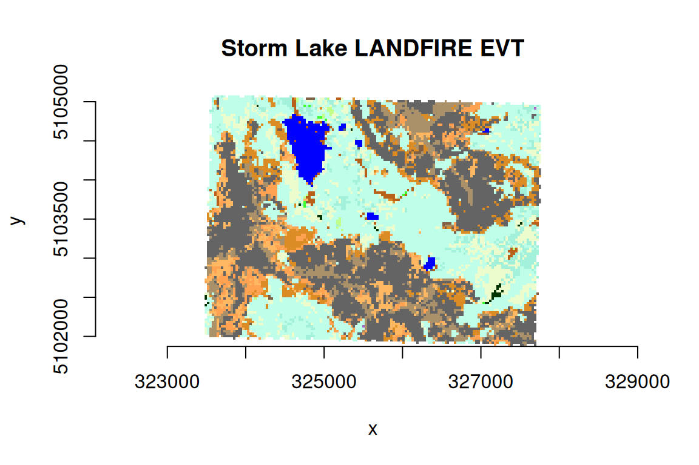

# Raster Attribute Tables

A GDAL Raster Attribute Table (RAT) provides attribute information about
pixel values. Raster attribute tables can be used to represent
histograms, color tables, and classification information. Each row in
the table applies to either a single pixel value or a range of values,
and might have attributes such as the histogram count for that value (or
range), the color that pixels of that value (or range) should be
displayed, names of classes, or various other information.
**gdalraster** supports reading Raster Attribute Tables as R data frame,
building new tables, and setting a default RAT on a raster band.

## Format of GDAL RAT

Each column in a raster attribute table has a name, a type (integer,
floating point or string), and a `GDALRATFieldUsage`. The field usage
distinguishes columns with particular understood purposes (such as
color, histogram count, class name), and columns that have other
purposes not understood by the library (long labels, ancillary
attributes, etc).

In the general case, each row has a field indicating the minimum pixel
value falling into that category, and a field indicating the maximum
pixel value. In the GDAL API, these are indicated with usage values of
`GFU_Min` and `GFU_Max` (`GDALRATFieldUsage` enumeration constants).
This vignette will focus on the particular but common case where each
row is a discrete pixel value. In this case, a single column with usage
`GFU_MinMax` (indicating class value) would be used instead of separate
min and max columns. The table is represented in R as a data frame with
column attribute `"GFU"` containing the field usage, e.g., `"MinMax"`
(case-sensitive string). Other field usage types include `"PixelCount"`
(`GFU_PixelCount`, histogram pixel count), `"Name"` (`GFU_Name`, class
name), `"Red"` (`GFU_Red`, class color 0-255), `"Green"` (`GFU_Green`,
class color 0-255), `"Blue"` (`GFU_Blue`, class color 0-255), and
`"Generic"` (`GFU_Generic`, general purpose field).

A raster attribute table can be used with thematic or athematic
(continuous) data. This is defined in R by an attribute on the data
frame named `"GDALRATTableType"` with a value of either `"thematic"` or
`"athematic"`.

## Read/build/set attribute tables

**gdalraster** can read, build and set Raster Attribute Tables via data
frame. An object of class `GDALRaster` has method `$getDefaultRAT()` to
read an existing RAT, and method `$setDefaultRAT()` to set a RAT from a
data frame. The stand-alone function
[`buildRAT()`](https://usdaforestservice.github.io/gdalraster/reference/buildRAT.md)
scans a raster to obtain the set of unique pixel values and their
counts, optionally joins additional columns from a passed data frame,
and returns a data frame with the appropriate metadata automatically
assigned (i.e., R attributes assigned on the data frame and its columns
that define usage as a GDAL RAT, for passing to
`GDALRaster$setDefaultRAT()`):

``` r
library(gdalraster)
#> GDAL 3.8.4 (released 2024-02-08), GEOS 3.12.1, PROJ 9.4.0

# LANDFIRE Existing Vegetation Type (EVT)
evt_file <- system.file("extdata/storml_evt.tif", package="gdalraster")

# make a copy to modify
f <- paste0(tempdir(), "/", "storml_evt_tmp.tif")
file.copy(evt_file,  f)
#> [1] TRUE
ds <- new(GDALRaster, f, read_only=FALSE)
ds$getDefaultRAT(band=1)
#> NULL

# get the full attribute table for LANDFIRE EVT from its CSV file
evt_csv <- system.file("extdata/LF20_EVT_220.csv", package="gdalraster")
evt_df <- read.csv(evt_csv)
nrow(evt_df)
#> [1] 860
head(evt_df)
#>   VALUE                                            EVT_NAME EVT_LF EVT_PHYS   R
#> 1 -9999                                         Fill-NoData   <NA>     <NA> 255
#> 2  7008                          North Pacific Oak Woodland   Tree Hardwood 203
#> 3  7009 Northwestern Great Plains Aspen Forest and Parkland   Tree Hardwood 192
#> 4  7010       Northern Rocky Mountain Western Larch Savanna   Tree  Conifer 180
#> 5  7011            Rocky Mountain Aspen Forest and Woodland   Tree Hardwood 192
#> 6  7012       Rocky Mountain Bigtooth Maple Ravine Woodland   Tree Hardwood 171
#>     G   B      RED GREEN     BLUE
#> 1 255 255 1.000000     1 1.000000
#> 2 255 171 0.796078     1 0.670588
#> 3 255 138 0.752941     1 0.541176
#> 4 255 148 0.705882     1 0.580392
#> 5 255 138 0.752941     1 0.541176
#> 6 255 138 0.670588     1 0.541176

# keep just the R, G, B fields (0-255) and drop RED, GREEN, BLUE
evt_df <- evt_df[,1:7]

# build a RAT for the EVT raster, attaching additional columns from evt_df
tbl <- buildRAT(ds,
                table_type = "thematic",
                na_value = -9999,
                join_df = evt_df)
#> scanning raster...
#> 0...10...20...30...40...50...60...70...80...90...100 - done.

nrow(tbl)
#> [1] 24
head(tbl)
#>   VALUE COUNT                                                          EVT_NAME
#> 1 -9999   876                                                       Fill-NoData
#> 2  7011    28                          Rocky Mountain Aspen Forest and Woodland
#> 3  7046  4564           Northern Rocky Mountain Subalpine Woodland and Parkland
#> 4  7050   570                              Rocky Mountain Lodgepole Pine Forest
#> 5  7055   889 Rocky Mountain Subalpine Dry-Mesic Spruce-Fir Forest and Woodland
#> 6  7056   304 Rocky Mountain Subalpine Mesic-Wet Spruce-Fir Forest and Woodland
#>   EVT_LF EVT_PHYS   R   G   B
#> 1   <NA>     <NA> 255 255 255
#> 2   Tree Hardwood 192 255 138
#> 3   Tree  Conifer 191 255 233
#> 4   Tree  Conifer 163 240 219
#> 5   Tree  Conifer 236 252 204
#> 6   Tree  Conifer 236 252 204

# attributes on the returned data frame and its columns define RAT metadata
attr(tbl, "GDALRATTableType")
#> [1] "thematic"
attributes(tbl$VALUE)     # GFU_MinMax for column of discrete pixel values
#> $GFU
#> [1] "MinMax"
attributes(tbl$COUNT)     # pixel counts
#> $GFU
#> [1] "PixelCount"
attributes(tbl$EVT_NAME)  # the class names
#> $GFU
#> [1] "Name"
attributes(tbl$EVT_LF)    # ancillary attribute
#> $GFU
#> [1] "Generic"
attributes(tbl$EVT_PHYS)  # ancillary attribute
#> $GFU
#> [1] "Generic"
attributes(tbl$R)         # red 0-255
#> $GFU
#> [1] "Red"
attributes(tbl$G)         # green 0-255
#> $GFU
#> [1] "Green"
attributes(tbl$B)         # blue 0-255
#> $GFU
#> [1] "Blue"

# set as default RAT on the EVT raster
ds$setDefaultRAT(band=1, tbl)
#> [1] TRUE
ds$flushCache()

# it can now be read from the raster dataset
rm(tbl)
tbl <- ds$getDefaultRAT(band=1)
#> 0...10...20...30...40...50...60...70...80...90...100 - done.
nrow(tbl)
#> [1] 24
```

## Display attribute tables

An attribute table with RGB columns can be passed to
[`gdalraster::plot_raster()`](https://usdaforestservice.github.io/gdalraster/reference/plot_raster.md)
as a color table (columns `VALUE`, `R`, `G`, `B`):

``` r
bb <- ds$bbox()
#| fig.alt: >
#|   A plot of LANDFIRE Existing Vegetation Type (EVT) for an area of interest
#|   named Storm Lake which is used for several example datasets in package
#|   gdalraster. A color map has been to the pixels using color values provided
#|   by LANDFIRE in the CSV attribute table for the EVT layer.
plot_raster(data = ds,
            col_tbl = tbl[,c(1,6:8)],
            maxColorValue = 255,
            interpolate = FALSE,
            main = "Storm Lake LANDFIRE EVT")
```



The function
[`displayRAT()`](https://usdaforestservice.github.io/gdalraster/reference/displayRAT.md)
generates a nicely formatted table for display. Colors are shown if the
RAT contains RGB columns:

``` r
displayRAT(tbl, title = "Raster Attribute Table for Storm Lake EVT")
```

| Raster Attribute Table for Storm Lake EVT |       |       |                                                                   |        |                    |     |     |     |
|-------------------------------------------|-------|-------|-------------------------------------------------------------------|--------|--------------------|-----|-----|-----|
| Color                                     | VALUE | COUNT | EVT_NAME                                                          | EVT_LF | EVT_PHYS           | R   | G   | B   |
| \#FFFFFF                                  | -9999 | 876   | Fill-NoData                                                       | NA     | NA                 | 255 | 255 | 255 |
| \#C0FF8A                                  | 7011  | 28    | Rocky Mountain Aspen Forest and Woodland                          | Tree   | Hardwood           | 192 | 255 | 138 |
| \#BFFFE9                                  | 7046  | 4564  | Northern Rocky Mountain Subalpine Woodland and Parkland           | Tree   | Conifer            | 191 | 255 | 233 |
| \#A3F0DB                                  | 7050  | 570   | Rocky Mountain Lodgepole Pine Forest                              | Tree   | Conifer            | 163 | 240 | 219 |
| \#ECFCCC                                  | 7055  | 889   | Rocky Mountain Subalpine Dry-Mesic Spruce-Fir Forest and Woodland | Tree   | Conifer            | 236 | 252 | 204 |
| \#ECFCCC                                  | 7056  | 304   | Rocky Mountain Subalpine Mesic-Wet Spruce-Fir Forest and Woodland | Tree   | Conifer            | 236 | 252 | 204 |
| \#3FFF2E                                  | 7057  | 11    | Rocky Mountain Subalpine-Montane Limber-Bristlecone Pine Woodland | Tree   | Conifer            | 63  | 255 | 46  |
| \#AB916A                                  | 7070  | 267   | Rocky Mountain Alpine Dwarf-Shrubland                             | Shrub  | Shrubland          | 171 | 145 | 106 |
| \#75573D                                  | 7106  | 3     | Northern Rocky Mountain Montane-Foothill Deciduous Shrubland      | Shrub  | Shrubland          | 117 | 87  | 61  |
| \#E69729                                  | 7125  | 1     | Inter-Mountain Basins Big Sagebrush Steppe                        | Shrub  | Shrubland          | 230 | 151 | 41  |
| \#DB8C25                                  | 7126  | 1082  | Inter-Mountain Basins Montane Sagebrush Steppe                    | Shrub  | Shrubland          | 219 | 140 | 37  |
| \#FFB861                                  | 7140  | 679   | Northern Rocky Mountain Subalpine-Upper Montane Grassland         | Herb   | Grassland          | 255 | 184 | 97  |
| \#AB916A                                  | 7143  | 199   | Rocky Mountain Alpine Fell-Field                                  | Herb   | Grassland          | 171 | 145 | 106 |
| \#AB916A                                  | 7144  | 765   | Rocky Mountain Alpine Turf                                        | Herb   | Grassland          | 171 | 145 | 106 |
| \#FFA352                                  | 7145  | 681   | Rocky Mountain Subalpine-Montane Mesic Meadow                     | Herb   | Grassland          | 255 | 163 | 82  |
| \#003300                                  | 7166  | 32    | Middle Rocky Mountain Montane Douglas-fir Forest and Woodland     | Tree   | Conifer            | 0   | 51  | 0   |
| \#806145                                  | 7169  | 60    | Northern Rocky Mountain Subalpine Deciduous Shrubland             | Shrub  | Shrubland          | 128 | 97  | 69  |
| \#0000FF                                  | 7292  | 397   | Open Water                                                        | Water  | Open Water         | 0   | 0   | 255 |
| \#AA66CD                                  | 7901  | 2     | Western Cool Temperate Urban Evergreen Forest                     | Tree   | Developed          | 170 | 102 | 205 |
| \#646464                                  | 9016  | 2486  | Rocky Mountain Alpine Bedrock and Scree                           | Sparse | Sparsely Vegetated | 100 | 100 | 100 |
| \#B86018                                  | 9017  | 13    | Rocky Mountain Alpine-Montane Wet Meadow                          | Herb   | Riparian           | 184 | 96  | 24  |
| \#646464                                  | 9018  | 1280  | Rocky Mountain Cliff Canyon and Massive Bedrock                   | Sparse | Sparsely Vegetated | 100 | 100 | 100 |
| \#B86018                                  | 9021  | 14    | Rocky Mountain Subalpine-Montane Riparian Shrubland               | Shrub  | Riparian           | 184 | 96  | 24  |
| \#B86018                                  | 9022  | 98    | Rocky Mountain Subalpine-Montane Riparian Woodland                | Tree   | Riparian           | 184 | 96  | 24  |

[`displayRAT()`](https://usdaforestservice.github.io/gdalraster/reference/displayRAT.md)
returns an object of class `"gt_tbl"`. The table object can be modified
using functions of the **gt** package.

``` r
ds$close()
```

## Using in QGIS

QGIS since 3.30 includes [extensive support for Raster Attribute
Tables](https://qgis.org/project/visual-changelogs/visualchangelog330/#feature-raster-attribute-tables-rat-support).

For QGIS \< 3.30, the **Raster Attribute Table Plugin** can be used to
edit and display RATs for discrete rasters using the
paletted/unique-values renderer (QGIS-style classification on arbitrary
RAT columns). With the plugin enabled, “Open Attribute Table” can be
selected after right-clicking a raster layer that has an associated RAT.
For the LANDFIRE EVT layer as modified above, classifying on EVT_NAME
generates the following display:


LANDFIRE EVT in the Raster Attribute Table QGIS Plugin

## See also

- Documentation for
  [`gdalraster::buildRAT()`](https://usdaforestservice.github.io/gdalraster/reference/buildRAT.html)

- [GDALRasterAttributeTable Class
  Reference](https://gdal.org/en/stable/doxygen/classGDALRasterAttributeTable.html)

- [Raster Attribute Table QGIS
  GUI](https://github.com/qgis/QGIS/pull/50687) (since QGIS 3.30;
  examples for different use cases and workflows)

- [Raster Attribute Table QGIS
  Plugin](https://github.com/noaa-ocs-hydrography/qgis-raster-attribute-table-plugin)
  (QGIS \< 3.30)

- Package [gt](https://CRAN.R-project.org/package=gt)

## Data sources

The example dataset is Existing Vegetation Type (EVT) from the LANDFIRE
Program (LF 2020 version, <https://landfire.gov/>). Map units are based
on [NatureServe Ecological
Systems](https://www.natureserve.org/products/terrestrial-ecological-systems-united-states).
