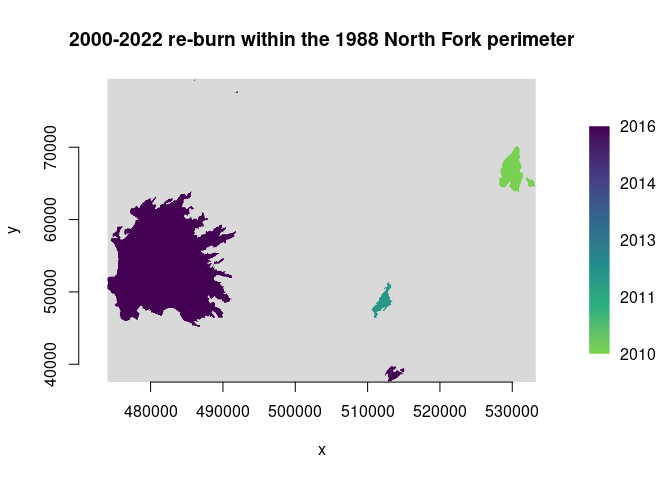
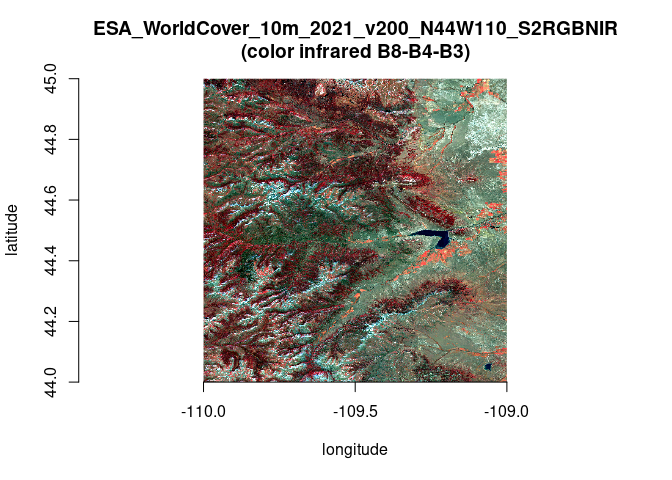

```{r, include = FALSE}
knitr::opts_chunk$set(
  collapse = TRUE,
  comment = "#>"
)
```

Chris Toney (chris.toney at usda.gov)

Last modified: 2024-03-02

## Summary

This document describes R bindings to the GDAL/OGR Vector API proposed for inclusion in package **gdalraster**, analogous to its existing raster support. A package providing low-level access to both the raster and vector APIs in GDAL should be of interest to developers creating higher level interfaces. For example, custom workflows that are I/O intensive may benefit from direct access to GDAL's I/O capabilities. R bindings to the vector API would support persistent connections to the data store, cursors with attribute and spatial filtering, transactions, feature-level insert/delete, update of attributes and geometries, and OGR facilities for geoprocessing. Calling signatures of a class-based interface will resemble the C++ and Python APIs provided by the GDAL project. It is intended that bindings in **gdalraster** should provide long-term API stability while tracking changes GDAL.

A proposed interface is described in terms of the [GDAL Vector Data Model](https://gdal.org/user/vector_data_model.html), along with a draft class definition for implementation via `RCPP_EXPOSED_CLASS`. A prototype of the bindings is in the `gdalvector` branch at <https://github.com/USDAForestService/gdalraster/tree/gdalvector>. The prototype bindings are currently undocumented. Code examples are included here to demonstrate usage and proof-of-concept. Installation of the development version of **gdalraster** containing the prototype vector bindings could be done with:

```{r, eval=FALSE}
remotes::install_github("USDAForestService/gdalraster", ref = "gdalvector")
```

## Description of the interface

Bindings will be implemented with **Rcpp** modules including `RCPP_EXPOSED_CLASS`. Exposing C++ classes directly in R provides a natural interface to the underlying object model.

A  GDAL Dataset for vector is a file or database containing one or more OGR layers. A vector dataset is represented in R as a data source name (DSN), a character string that may be a filename, database connection string, URL, virtual file, etc. Management of datasets and their vector schemas will be done with:

* existing management functions in **gdalraster** that operate on vector datasets: `copyDatasetFiles()`, `deleteDataset()`, `renameDataset()` and `addFilesInZip()` (supports SOZip)
* existing internal utility functions to be further developed: `.ogr_ds_exists()`, `.create_ogr()`, `.ogr_ds_layer_count()`, `.ogr_layer_exists()`, `.ogr_layer_create()`, `.ogr_layer_delete()` `.ogr_field_index()`, `.ogr_field_create()`
* wrappers for `vector_translate()` and `vector_info()` from the gdal_utils.h API (**gdalraster** 1.10)
* additional stand-alone functions TBD

OGR Layer class represents a layer of features within a data source. It will be modeled in R as class `GDALVector`, an exposed C++ class encapsulating an OGR Layer and the GDAL Dataset that owns it. A `GDALVector` object will persist an open connection to the dataset and expose methods for retrieving layer information, setting attribute and spatial filters, reading/writing features, and layer geoprocessing. A draft definition for class `GDALVector` is given below.

All features in an OGR Layer share a common schema (feature class) modeled in GDAL as OGR Feature Definition. A feature class definition includes the set of attribute fields and their data types, the geometry field(s), and a feature class name (normally used as a layer name). The feature class definition is represented as a list in R, having as names the attribute/geometry field names, with each list element holding a field definition.

An attribute field definition is a list with named elements:

```
$type       : OGR Field Type ("OFTString", "OFTInteger", ...)
$subtype    : optional ("OFSTBoolean", ...) 
$width      : optional max number of characters
$precision  : optional number of digits after the decimal point
$is_nullable: optional NOT NULL constraint (logical scalar)
$is_unique  : optional UNIQUE constraint (logical scalar)
$default    : optional field default value as character string
$is_ignored : whether ignored when retrieving features (logical scalar)
$domain     : optional domain name
$is_geom    : FALSE for attribute fields
```

A geometry field definition is a list with named elements:

```
$type       : geom type ("Point", "Polygon", etc.)
$srs        : optional spatial reference as WKT string
$is_nullable: optional NOT NULL constraint (logical scalar)
$is_ignored : whether ignored when retrieving features (logical scalar)
$is_geom    : TRUE for geometry fields
```

An OGR Feature &ndash; as read by `GDALVector::getNextFeature()` or `GDALVector::getFeature()`, or as passed to write methods &ndash; is a list with the unique feature identifier (FID), attribute and geometry field names, and their values. `GDALVector::getFeatureSet()` will return a set of features as a data frame. (Note that FID is an `int64` type in GDAL. Handling of `int64` TBD, currently as R `double` type).

An OGR Geometry is represented in R as a character string containing OGC Well Known Text (WKT). Likewise, an OGR Spatial Reference, which encapsulates the definition of a projection and datum, is represented in R as WKT. **gdalraster** has existing functions for working with spatial reference systems as WKT (`srs_to_wkt()`, `srs_is_projected()`, etc.), and a set of geometry convenience functions also operating on WKT (GEOS via GDAL headers).

## class GDALVector

The draft class definition below has been partially implemented in:

<https://github.com/USDAForestService/gdalraster/blob/gdalvector/src/gdalvector.cpp>

This does not include definitions of several stand-alone functions that will provide schema management. The existing definitions in `src/ogr_util.h` are a starting point for those. An **Rcpp** `.finalizer` function will be implemented to properly release resources in case an object of class `GDALVector` is garbage collected without an explicit call to `close()`.

```cpp
class GDALVector {

	private:
	std::string dsn_in;
	std::string layer_in;  // layer name or sql statement
	bool is_sql_in;
	Rcpp::CharacterVector open_options_in;
	GDALDatasetH  hDataset;
	GDALAccess eAccess;
	OGRLayerH hLayer;
	OGRFeatureDefnH hFDefn;
	
	public:
	GDALVector();
	GDALVector(Rcpp::CharacterVector dsn);
	GDALVector(Rcpp::CharacterVector dsn, std::string layer);
	GDALVector(Rcpp::CharacterVector dsn, std::string layer, bool read_only);
	GDALVector(Rcpp::CharacterVector dsn, std::string layer, bool read_only,
			Rcpp::CharacterVector open_options);

	void open(bool read_only);
	bool isOpen() const;
	std::string getDsn() const;
	Rcpp::CharacterVector getFileList() const;
	std::string getDriverShortName() const;
	std::string getDriverLongName() const;

	std::string getName() const;
	bool testCapability(std::string capability) const;
	std::string getFIDColumn() const;
	std::string getGeomType() const;
	std::string getGeometryColumn() const;
	std::string getSpatialRef() const;
	Rcpp::NumericVector bbox();
	Rcpp::List getLayerDefn() const;
	
	void setAttributeFilter(std::string query);
	void setSpatialFilterRect(Rcpp::NumericVector bbox);
	void setSpatialFilter(std::string wkt);
	void clearSpatialFilter();
	
	double getFeatureCount();
	SEXP getNextFeature();
	void resetReading();
	SEXP getFeature(GIntBig fid);         // int64 handling TBD
	
	Rcpp::DataFrame getFeatureSet(Rcpp::CharacterVector fields,
	                              bool geom_column);
	
	void createFeature(Rcpp::List feat);
	void setFeature(Rcpp::List feat);
	void upsertFeature(Rcpp::List feat);
	void deleteFeature(GIntBig fid);      // int64 handling TBD
	
	bool startTransaction(bool force);
	bool commitTransaction();
	bool rollbackTransaction();

	void layerIntersection(
			GDALVector method_layer,
			GDALVector result_layer,
			bool quiet,
			Rcpp::Nullable<Rcpp::CharacterVector> options);
	void layerUnion(
			GDALVector method_layer,
			GDALVector result_layer,
			bool quiet,
			Rcpp::Nullable<Rcpp::CharacterVector> options);
	void layerSymDifference(
			GDALVector method_layer,
			GDALVector result_layer,
			bool quiet,
			Rcpp::Nullable<Rcpp::CharacterVector> options);
	void layerIdentity(
			GDALVector method_layer,
			GDALVector result_layer,
			bool quiet,
			Rcpp::Nullable<Rcpp::CharacterVector> options);
	void layerUpdate(
			GDALVector method_layer,
			GDALVector result_layer,
			bool quiet,
			Rcpp::Nullable<Rcpp::CharacterVector> options);
	void layerClip(
			GDALVector method_layer,
			GDALVector result_layer,
			bool quiet,
			Rcpp::Nullable<Rcpp::CharacterVector> options);
	void layerErase(
			GDALVector method_layer,
			GDALVector result_layer,
			bool quiet,
			Rcpp::Nullable<Rcpp::CharacterVector> options);

	void close();
	
	// methods for internal use not exported to R
	void _checkAccess(GDALAccess access_needed) const;
	OGRLayerH _getOGRLayerH();
};

RCPP_EXPOSED_CLASS(GDALVector)
```

## Example: usage for class GDALVector

``` r

library(gdalraster)
#> GDAL 3.8.3, released 2024/01/04, PROJ 9.3.1

# MTBS fires in Yellowstone National Park 1984-2022
f <- system.file("extdata/ynp_fires_1984_2022.gpkg", package="gdalraster")
# copy to a temporary in-memory file that is writeable
dsn <- paste0("/vsimem/", basename(f))
vsi_copy_file(f, dsn)

lyr <- new(GDALVector, dsn, "mtbs_perims")

# dataset info
lyr$getDriverShortName()
#> [1] "GPKG"
lyr$getDriverLongName()
#> [1] "GeoPackage"
lyr$getFileList()
#> [1] "/vsimem/ynp_fires_1984_2022.gpkg"

# layer info
lyr$getName()
#> [1] "mtbs_perims"
lyr$getGeomType()
#> [1] "Multi Polygon"
lyr$getGeometryColumn()
#> [1] "geom"
lyr$getFIDColumn()
#> [1] "fid"
lyr$getSpatialRef()
#> [1] "PROJCS[\"NAD83 / Montana\",GEOGCS[\"NAD83\",DATUM[\"North_American_Datum_1983\",SPHEROID[\"GRS 1980\",6378137,298.257222101,AUTHORITY[\"EPSG\",\"7019\"]],AUTHORITY[\"EPSG\",\"6269\"]],PRIMEM[\"Greenwich\",0,AUTHORITY[\"EPSG\",\"8901\"]],UNIT[\"degree\",0.0174532925199433,AUTHORITY[\"EPSG\",\"9122\"]],AUTHORITY[\"EPSG\",\"4269\"]],PROJECTION[\"Lambert_Conformal_Conic_2SP\"],PARAMETER[\"latitude_of_origin\",44.25],PARAMETER[\"central_meridian\",-109.5],PARAMETER[\"standard_parallel_1\",49],PARAMETER[\"standard_parallel_2\",45],PARAMETER[\"false_easting\",600000],PARAMETER[\"false_northing\",0],UNIT[\"metre\",1,AUTHORITY[\"EPSG\",\"9001\"]],AXIS[\"Easting\",EAST],AXIS[\"Northing\",NORTH],AUTHORITY[\"EPSG\",\"32100\"]]"
lyr$bbox()
#> [1] 469685.73 -12917.76 573531.72  96577.34

# layer capabilities
lyr$testCapability("RandomRead")
#> [1] TRUE
lyr$testCapability("FastSpatialFilter")
#> [1] TRUE
lyr$testCapability("FastFeatureCount")
#> [1] TRUE
lyr$testCapability("FastGetExtent")
#> [1] TRUE
lyr$testCapability("Transactions")
#> [1] TRUE

# the dataset was opened read-only:
lyr$testCapability("SequentialWrite")
#> [1] FALSE
lyr$testCapability("RandomWrite")
#> [1] FALSE

# re-open with write access
lyr$open(read_only = FALSE)
lyr$testCapability("SequentialWrite")
#> [1] TRUE
lyr$testCapability("RandomWrite")
#> [1] TRUE

# feature class definition - a list of fields and their definitions
defn <- lyr$getLayerDefn()
names(defn)
#>  [1] "event_id"     "incid_name"   "incid_type"   "map_id"       "burn_bnd_ac" 
#>  [6] "burn_bnd_lat" "burn_bnd_lon" "ig_date"      "ig_year"      "geom"

# each list element holds a field definition list
str(defn)
#> List of 10
#>  $ event_id    :List of 8
#>   ..$ type       : chr "OFTString"
#>   ..$ width      : int 254
#>   ..$ precision  : int 0
#>   ..$ is_nullable: logi TRUE
#>   ..$ is_unique  : logi FALSE
#>   ..$ default    : chr ""
#>   ..$ is_ignored : logi FALSE
#>   ..$ is_geom    : logi FALSE
#>  $ incid_name  :List of 8
#>   ..$ type       : chr "OFTString"
#>   ..$ width      : int 254
#>   ..$ precision  : int 0
#>   ..$ is_nullable: logi TRUE
#>   ..$ is_unique  : logi FALSE
#>   ..$ default    : chr ""
#>   ..$ is_ignored : logi FALSE
#>   ..$ is_geom    : logi FALSE
#>  $ incid_type  :List of 8
#>   ..$ type       : chr "OFTString"
#>   ..$ width      : int 254
#>   ..$ precision  : int 0
#>   ..$ is_nullable: logi TRUE
#>   ..$ is_unique  : logi FALSE
#>   ..$ default    : chr ""
#>   ..$ is_ignored : logi FALSE
#>   ..$ is_geom    : logi FALSE
#>  $ map_id      :List of 8
#>   ..$ type       : chr "OFTInteger64"
#>   ..$ width      : int 0
#>   ..$ precision  : int 0
#>   ..$ is_nullable: logi TRUE
#>   ..$ is_unique  : logi FALSE
#>   ..$ default    : chr ""
#>   ..$ is_ignored : logi FALSE
#>   ..$ is_geom    : logi FALSE
#>  $ burn_bnd_ac :List of 8
#>   ..$ type       : chr "OFTInteger64"
#>   ..$ width      : int 0
#>   ..$ precision  : int 0
#>   ..$ is_nullable: logi TRUE
#>   ..$ is_unique  : logi FALSE
#>   ..$ default    : chr ""
#>   ..$ is_ignored : logi FALSE
#>   ..$ is_geom    : logi FALSE
#>  $ burn_bnd_lat:List of 8
#>   ..$ type       : chr "OFTString"
#>   ..$ width      : int 10
#>   ..$ precision  : int 0
#>   ..$ is_nullable: logi TRUE
#>   ..$ is_unique  : logi FALSE
#>   ..$ default    : chr ""
#>   ..$ is_ignored : logi FALSE
#>   ..$ is_geom    : logi FALSE
#>  $ burn_bnd_lon:List of 8
#>   ..$ type       : chr "OFTString"
#>   ..$ width      : int 10
#>   ..$ precision  : int 0
#>   ..$ is_nullable: logi TRUE
#>   ..$ is_unique  : logi FALSE
#>   ..$ default    : chr ""
#>   ..$ is_ignored : logi FALSE
#>   ..$ is_geom    : logi FALSE
#>  $ ig_date     :List of 8
#>   ..$ type       : chr "default (read as OFTString)"
#>   ..$ width      : int 0
#>   ..$ precision  : int 0
#>   ..$ is_nullable: logi TRUE
#>   ..$ is_unique  : logi FALSE
#>   ..$ default    : chr ""
#>   ..$ is_ignored : logi FALSE
#>   ..$ is_geom    : logi FALSE
#>  $ ig_year     :List of 8
#>   ..$ type       : chr "OFTInteger"
#>   ..$ width      : int 0
#>   ..$ precision  : int 0
#>   ..$ is_nullable: logi TRUE
#>   ..$ is_unique  : logi FALSE
#>   ..$ default    : chr ""
#>   ..$ is_ignored : logi FALSE
#>   ..$ is_geom    : logi FALSE
#>  $ geom        :List of 5
#>   ..$ type       : chr "Multi Polygon"
#>   ..$ srs        : chr "PROJCS[\"NAD83 / Montana\",GEOGCS[\"NAD83\",DATUM[\"North_American_Datum_1983\",SPHEROID[\"GRS 1980\",6378137,2"| __truncated__
#>   ..$ is_nullable: logi TRUE
#>   ..$ is_ignored : logi FALSE
#>   ..$ is_geom    : logi TRUE

lyr$getFeatureCount()
#> [1] 61

# cursor
feat <- lyr$getNextFeature()
# a list of field names and their values
str(feat)
#> List of 11
#>  $ FID         : num 1
#>  $ event_id    : chr "WY4413411069519870807"
#>  $ incid_name  : chr "POLECAT"
#>  $ incid_type  : chr "Wildfire"
#>  $ map_id      : num 1e+07
#>  $ burn_bnd_ac : num 1093
#>  $ burn_bnd_lat: chr "44.132"
#>  $ burn_bnd_lon: chr "-110.696"
#>  $ ig_date     : chr "1987/08/07"
#>  $ ig_year     : int 1987
#>  $ geom        : chr "MULTIPOLYGON (((503099.439579653 -12893.9672899192,503169.756694236 -12756.3721247327,502689.845907435 -12131.5"| __truncated__

# attribute filter
lyr$setAttributeFilter("ig_year = 2020")
lyr$getFeatureCount()
#> [1] 1

feat <- lyr$getNextFeature()
str(feat)
#> List of 11
#>  $ FID         : num 61
#>  $ event_id    : chr "WY4438911082120200822"
#>  $ incid_name  : chr "LONE STAR"
#>  $ incid_type  : chr "Wildfire"
#>  $ map_id      : num 1e+07
#>  $ burn_bnd_ac : num 3348
#>  $ burn_bnd_lat: chr "44.4"
#>  $ burn_bnd_lon: chr "-110.782"
#>  $ ig_date     : chr "2020/08/22"
#>  $ ig_year     : int 2020
#>  $ geom        : chr "MULTIPOLYGON (((496593.122306971 15506.8828590633,496491.761299067 15605.3612548792,496290.812130161 15388.0465"| __truncated__

# NULL if no more features are available
feat <- lyr$getNextFeature()
str(feat)
#>  NULL

# reset reading to the start
lyr$resetReading()
feat <- lyr$getNextFeature()
str(feat)
#> List of 11
#>  $ FID         : num 61
#>  $ event_id    : chr "WY4438911082120200822"
#>  $ incid_name  : chr "LONE STAR"
#>  $ incid_type  : chr "Wildfire"
#>  $ map_id      : num 1e+07
#>  $ burn_bnd_ac : num 3348
#>  $ burn_bnd_lat: chr "44.4"
#>  $ burn_bnd_lon: chr "-110.782"
#>  $ ig_date     : chr "2020/08/22"
#>  $ ig_year     : int 2020
#>  $ geom        : chr "MULTIPOLYGON (((496593.122306971 15506.8828590633,496491.761299067 15605.3612548792,496290.812130161 15388.0465"| __truncated__

# clear attribute filter
lyr$setAttributeFilter("")
lyr$getFeatureCount()
#> [1] 61

# spatial filter
# get the bounding box of the largest 1988 fire
lyr$setAttributeFilter("ig_year = 1988 ORDER BY burn_bnd_ac DESC")
feat <- lyr$getNextFeature()
str(feat)
#> List of 11
#>  $ FID         : num 7
#>  $ event_id    : chr "WY4470811082119880722"
#>  $ incid_name  : chr "NORTH FORK"
#>  $ incid_type  : chr "Wildfire"
#>  $ map_id      : num 1e+07
#>  $ burn_bnd_ac : num 563527
#>  $ burn_bnd_lat: chr "44.678"
#>  $ burn_bnd_lon: chr "-110.716"
#>  $ ig_date     : chr "1988/07/22"
#>  $ ig_year     : int 1988
#>  $ geom        : chr "MULTIPOLYGON (((469685.969312071 29526.2354109807,469918.933844832 29654.3220754602,470030.299119989 29518.7441"| __truncated__

bbox <- bbox_from_wkt(feat$geom)
print(bbox)
#> [1] 469685.97  11442.45 544069.63  85508.15

# clear the attribute filter
lyr$setAttributeFilter("")
lyr$getFeatureCount()
#> [1] 61

lyr$setSpatialFilterRect(bbox)
lyr$getFeatureCount()
#> [1] 40

lyr$clearSpatialFilter()
lyr$getFeatureCount()
#> [1] 61

lyr$close()
vsi_unlink(dsn)
```

## Example: layer geoprocessing

``` r

## layer intersection example

library(gdalraster)
#> GDAL 3.8.3, released 2024/01/04, PROJ 9.3.1

# MTBS fires in Yellowstone National Park 1984-2022
dsn <- system.file("extdata/ynp_fires_1984_2022.gpkg", package="gdalraster")
lyr <- new(GDALVector, dsn, "mtbs_perims")

# largest 1988 fire (FID from the example above)
# Note that retrieving a feature by FID would normally be done with
# lyr$getFeature(fid), but that method is not exposed in the prototype yet.
lyr$setAttributeFilter("FID = 7")
lyr$getFeatureCount()
#> [1] 1
feat <- lyr$getNextFeature()
str(feat)
#> List of 11
#>  $ FID         : num 7
#>  $ event_id    : chr "WY4470811082119880722"
#>  $ incid_name  : chr "NORTH FORK"
#>  $ incid_type  : chr "Wildfire"
#>  $ map_id      : num 1e+07
#>  $ burn_bnd_ac : num 563527
#>  $ burn_bnd_lat: chr "44.678"
#>  $ burn_bnd_lon: chr "-110.716"
#>  $ ig_date     : chr "1988/07/22"
#>  $ ig_year     : int 1988
#>  $ geom        : chr "MULTIPOLYGON (((469685.969312071 29526.2354109807,469918.933844832 29654.3220754602,470030.299119989 29518.7441"| __truncated__

# get a second layer for 2000-2022 fires
# the layer argument can be a sql statement
sql <- "SELECT FID, * FROM mtbs_perims WHERE ig_year >= 2000 ORDER BY mtbs_perims.ig_year"
lyr2 <- new(GDALVector, dsn, sql)
lyr2$getFeatureCount()
#> [1] 40

# create an output layer using a temporary in-memory dataset
dsn_out <- "/vsimem/lyr_proc_tmp.gpkg"
srs <- lyr$getSpatialRef()
# this uses existing internal OGR utilities
gdalraster:::.create_ogr("GPKG", dsn_out, 0, 0, 0, "Unknown", "result_layer", srs)
#> [1] TRUE
gdalraster:::.ogr_ds_exists(dsn_out, with_update = TRUE)
#> [1] TRUE
gdalraster:::.ogr_layer_exists(dsn_out, "result_layer")
#> [1] TRUE

lyr_out <- new(GDALVector, dsn_out, "result_layer", read_only = FALSE)
lyr_out$getFeatureCount()
#> [1] 0

# intersection of lyr and lyr2, with result in lyr_out
lyr$layerIntersection(lyr2, lyr_out, quiet = FALSE, options = NULL)
#> 0...10...20...30...40...50...60...70...80...90...100 - done.

lyr_out$getFeatureCount()
#> [1] 5
defn <- lyr_out$getLayerDefn()
# combined attributes
names(defn)
#>  [1] "input_event_id"      "input_incid_name"    "input_incid_type"   
#>  [4] "input_map_id"        "input_burn_bnd_ac"   "input_burn_bnd_lat" 
#>  [7] "input_burn_bnd_lon"  "input_ig_date"       "input_ig_year"      
#> [10] "method_event_id"     "method_incid_name"   "method_incid_type"  
#> [13] "method_map_id"       "method_burn_bnd_ac"  "method_burn_bnd_lat"
#> [16] "method_burn_bnd_lon" "method_ig_date"      "method_ig_year"     
#> [19] "geom"

# we don't have vector plotting yet, so rasterize and use plot_raster()
out_file <- "/vsimem/result_layer.tif"
rasterize(src_dsn = dsn_out,
          dstfile = out_file,
          layer = "result_layer",
          burn_attr = "method_ig_year",
          tr = c(90,90),
          tap = TRUE,
          dtName = "Int16",
          dstnodata = -9999,
          init = -9999)
#> 0...10...20...30...40...50...60...70...80...90...100 - done.

ds <- new(GDALRaster, out_file)
pal <- scales::viridis_pal(end = 0.8, direction = -1)(6)
ramp <- scales::colour_ramp(pal)
plot_raster(ds, legend = TRUE, col_map_fn = ramp, na_col = "#d9d9d9",
            main="2000-2022 re-burn within the 1988 North Fork perimeter")
```

<!-- -->

``` r

ds$close()
lyr$close()
lyr2$close()
lyr_out$close()

vsi_unlink(dsn_out)
vsi_unlink(out_file)
```

## Example: WorldCover Sentinel-2 composites

``` r
## WorldCover Sentinel-2 annual composites
## see: https://blog.vito.be/remotesensing/worldcover-annual-composites
## tile index lookup on remote filesystem and obtain raster data

library(gdalraster)
#> GDAL 3.8.3, released 2024/01/04, PROJ 9.3.1

fgb = "/vsicurl/https://esa-worldcover.s3.eu-central-1.amazonaws.com/esa_worldcover_grid_composites.fgb"
lyr_tiles <- new(GDALVector, fgb)

lyr_tiles$getDriverShortName()
#> [1] "FlatGeobuf"
lyr_tiles$getName()
#> [1] "worldcover_composites_grid_aws"
lyr_tiles$getGeomType()
#> [1] "Polygon"
lyr_tiles$getSpatialRef()
#> [1] "GEOGCS[\"WGS 84\",DATUM[\"WGS_1984\",SPHEROID[\"WGS 84\",6378137,298.257223563,AUTHORITY[\"EPSG\",\"7030\"]],AUTHORITY[\"EPSG\",\"6326\"]],PRIMEM[\"Greenwich\",0,AUTHORITY[\"EPSG\",\"8901\"]],UNIT[\"degree\",0.0174532925199433,AUTHORITY[\"EPSG\",\"9122\"]],AXIS[\"Latitude\",NORTH],AXIS[\"Longitude\",EAST],AUTHORITY[\"EPSG\",\"4326\"]]"

lyr_tiles$testCapability("RandomRead")
#> [1] TRUE
lyr_tiles$testCapability("FastSpatialFilter")
#> [1] TRUE
lyr_tiles$testCapability("FastFeatureCount")
#> [1] TRUE
lyr_tiles$testCapability("FastGetExtent")
#> [1] TRUE

lyr_tiles$getFeatureCount()
#> [1] 19363
lyr_tiles$bbox()
#> [1] -180  -60  180   83

defn <- lyr_tiles$getLayerDefn()
names(defn)
#>  [1] "tile"              "s1_vvvhratio_2020" "s1_vvvhratio_2021"
#>  [4] "s2_rgbnir_2020"    "s2_rgbnir_2021"    "s2_ndvi_2020"     
#>  [7] "s2_ndvi_2021"      "s2_swir_2020"      "s2_swir_2021"     
#> [10] ""

# AOI for the Fishhawk fire
dsn <- system.file("extdata/ynp_fires_1984_2022.gpkg", package="gdalraster")
lyr_ynp <- new(GDALVector, dsn, "mtbs_perims")

lyr_ynp$setAttributeFilter("incid_name = 'FISHHAWK'")
lyr_ynp$getFeatureCount()
#> [1] 1
feat <- lyr_ynp$getNextFeature()
str(feat)
#> List of 11
#>  $ FID         : num 60
#>  $ event_id    : chr "WY4437710988020190902"
#>  $ incid_name  : chr "FISHHAWK"
#>  $ incid_type  : chr "Wildfire"
#>  $ map_id      : num 1e+07
#>  $ burn_bnd_ac : num 10775
#>  $ burn_bnd_lat: chr "44.384"
#>  $ burn_bnd_lon: chr "-109.85"
#>  $ ig_date     : chr "2019/09/02"
#>  $ ig_year     : int 2019
#>  $ geom        : chr "MULTIPOLYGON (((573530.585472236 9160.22088906913,573266.183153384 9415.42216938034,573137.427110327 9285.44517"| __truncated__

# get the feature bbox in WGS84
bb <- g_transform(feat$geom, lyr_ynp$getSpatialRef(), epsg_to_wkt(4326)) |>
  bbox_from_wkt()
print(bb)
#> [1] -109.89753   44.32714 -109.83172   44.44030

# tile index lookup
lyr_tiles$setSpatialFilterRect(bb)
lyr_tiles$getFeatureCount()
#> [1] 1
feat <- lyr_tiles$getNextFeature()
str(feat)
#> List of 11
#>  $ FID              : num 16615
#>  $ tile             : chr "N44W110"
#>  $ s1_vvvhratio_2020: chr "s3://esa-worldcover-s1/vvvhratio/2020/N44/ESA_WorldCover_10m_2020_v100_N44W110_S1VVVHratio.tif"
#>  $ s1_vvvhratio_2021: chr "s3://esa-worldcover-s1/vvvhratio/2021/N44/ESA_WorldCover_10m_2021_v200_N44W110_S1VVVHratio.tif"
#>  $ s2_rgbnir_2020   : chr "s3://esa-worldcover-s2/rgbnir/2020/N44/ESA_WorldCover_10m_2020_v100_N44W110_S2RGBNIR.tif"
#>  $ s2_rgbnir_2021   : chr "s3://esa-worldcover-s2/rgbnir/2021/N44/ESA_WorldCover_10m_2021_v200_N44W110_S2RGBNIR.tif"
#>  $ s2_ndvi_2020     : chr "s3://esa-worldcover-s2/ndvi/2020/N44/ESA_WorldCover_10m_2020_v100_N44W110_NDVI.tif"
#>  $ s2_ndvi_2021     : chr "s3://esa-worldcover-s2/ndvi/2021/N44/ESA_WorldCover_10m_2021_v200_N44W110_NDVI.tif"
#>  $ s2_swir_2020     : chr "s3://esa-worldcover-s2/swir/2020/N44/ESA_WorldCover_10m_2020_v100_N44W110_SWIR.tif"
#>  $ s2_swir_2021     : chr "s3://esa-worldcover-s2/swir/2021/N44/ESA_WorldCover_10m_2021_v200_N44W110_SWIR.tif"
#>  $                  : chr "POLYGON ((-110 44,-110 45,-109 45,-109 44,-110 44))"

# get the Sentinel-2 RGBNIR composite for this AOI
tif_file <- sub("s3://", "/vsis3/", feat$s2_rgbnir_2021, fixed = TRUE)
print(tif_file)
#> [1] "/vsis3/esa-worldcover-s2/rgbnir/2021/N44/ESA_WorldCover_10m_2021_v200_N44W110_S2RGBNIR.tif"

# public bucket so disable request signing
set_config_option("AWS_NO_SIGN_REQUEST", "YES")

# check if file exists and get size in MB
vsi_stat(tif_file)
#> [1] TRUE
vsi_stat(tif_file, "size") / (1000 * 1000)
#> [1] 562.039

# copy to a local or remote filesystem, e.g.,
# tif_copy <- file.path(tempdir(), basename(tif_file))
# vsi_copy_file(tif_file, tif_copy, show_progress = TRUE)

# or open the dataset for reading
ds <- new(GDALRaster, tif_file)
ds$dim()
#> [1] 12000 12000     4
ds$getMetadata(band=0, domain="")
#>  [1] "algorithm_version=V2.0.0"                                                                                                                                            
#>  [2] "AREA_OR_POINT=Area"                                                                                                                                                  
#>  [3] "bands=Band 1: B04 (Red), Band 2: B03 (Green), Band 3: B02 (Blue), Band 4: B08 (Infrared)"                                                                            
#>  [4] "copyright=ESA WorldCover project 2021 / Contains modified Copernicus Sentinel data (2021) processed by ESA WorldCover consortium"                                    
#>  [5] "creation_time=2022-12-09 17:08:25.881589"                                                                                                                            
#>  [6] "description=The ESA WorldCover Sentinel-2 median L2A (RGBNIR) composite is a color image made from images in Blue (B02), Green (B03), Red (B04) and Infrared (B08). "
#>  [7] "license=CC-BY 4.0 - https://creativecommons.org/licenses/by/4.0/"                                                                                                    
#>  [8] "product_crs=EPSG:4326"                                                                                                                                               
#>  [9] "product_grid=1x1 degree tiling grid"                                                                                                                                 
#> [10] "product_tile=N44W110"                                                                                                                                                
#> [11] "product_type=Sentinel-2 median L2A (RGBNIR) composite"                                                                                                               
#> [12] "product_version=V2.0.0"                                                                                                                                              
#> [13] "reference=https://esa-worldcover.org"                                                                                                                                
#> [14] "time_end=2021-12-31T23:59:59Z"                                                                                                                                       
#> [15] "time_start=2021-01-01T00:00:00Z"                                                                                                                                     
#> [16] "title=ESA WorldCover Sentinel-2 median L2A (RGBNIR) composite at 10m resolution for year 2021"
ds$getMetadata(band=0, domain="IMAGE_STRUCTURE")
#> [1] "COMPRESSION=DEFLATE" "INTERLEAVE=PIXEL"    "LAYOUT=COG"         
#> [4] "PREDICTOR=2"

r <- read_ds(ds, bands=c(4,1,2), out_xsize = 800, out_ysize = 800)
txt <- paste0(tools::file_path_sans_ext(basename(tif_file)),
              "\n(color infrared B8-B4-B3)")
plot_raster(r,
            minmax_pct_cut = c(2, 98),
            xlab = "longitude",
            ylab = "latitude",
            main = txt)
```

<!-- -->

``` r
ds$close()
lyr_ynp$close()
lyr_tiles$close()

```

## Document changelog

* add `GDALVector::setSpatialFilter()` to the draft class definition - set spatial filter from WKT geometry (2024-03-02)
* add comment in the layer intersection example re: feature retrieval by FID (2024-03-02)
* add arguments `fields` and `geom_column` in `GDALVector::getFeatureSet()` - optionally retrieve a subset of attribute fields, and specify whether to include geometry column(s) in the returned data frame

