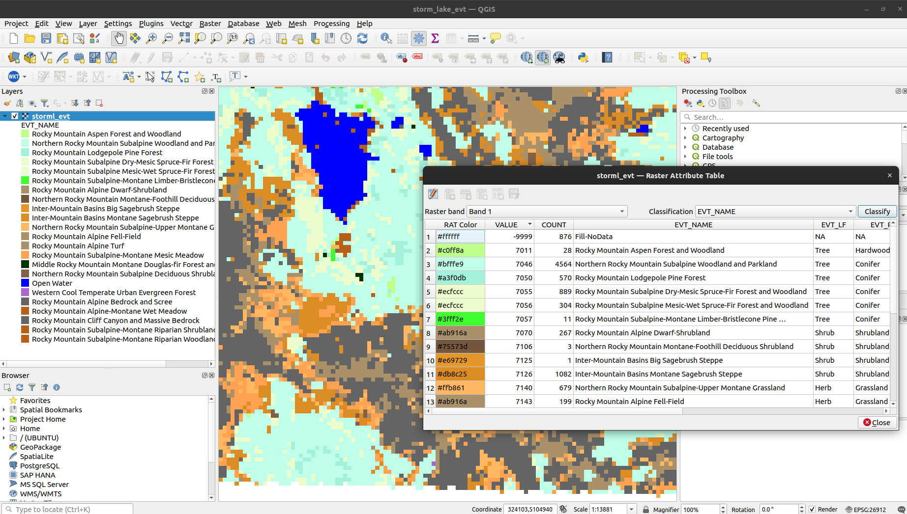

```{r, include = FALSE}
knitr::opts_chunk$set(
  collapse = TRUE,
  comment = "#>"
)
```

A GDAL Raster Attribute Table (RAT) provides attribute information about pixel values. Raster attribute tables can be used to represent histograms, color tables, and classification information. Each row in the table applies to either a single pixel value or a range of values, and might have attributes such as the histogram count for that value (or range), the color that pixels of that value (or range) should be displayed, names of classes, or various other information. **gdalraster** supports reading Raster Attribute Tables as R data frame, building new tables, and setting a default RAT on a raster band.

## Format of GDAL RAT

Each column in a raster attribute table has a name, a type (integer, floating point or string), and a `GDALRATFieldUsage`. The field usage distinguishes columns with particular understood purposes (such as color, histogram count, class name), and columns that have other purposes not understood by the library (long labels, ancillary attributes, etc).

In the general case, each row has a field indicating the minimum pixel value falling into that category, and a field indicating the maximum pixel value. In the GDAL API, these are indicated with usage values of `GFU_Min` and `GFU_Max` (`GDALRATFieldUsage` enumeration constants). This vignette will focus on the particular but common case where each row is a discrete pixel value. In this case, a single column with usage `GFU_MinMax` (indicating class value) would be used instead of separate min and max columns. The table is represented in R as a data frame with column attribute `"GFU"` containing the field usage, e.g., `"MinMax"` (case-sensitive string). Other field usage types include `"PixelCount"` (`GFU_PixelCount`, histogram pixel count), `"Name"` (`GFU_Name`, class name), `"Red"` (`GFU_Red`, class color 0-255), `"Green"` (`GFU_Green`, class color 0-255), `"Blue"` (`GFU_Blue`, class color 0-255), and `"Generic"` (`GFU_Generic`, general purpose field).

A raster attribute table can be used with thematic or athematic (continuous) data. This is defined in R by an attribute on the data frame named `"GDALRATTableType"` with a value of either `"thematic"` or `"athematic"`.

## Read/build/set attribute tables

**gdalraster** can read, build and set Raster Attribute Tables via data frame. An object of class `GDALRaster` has method `$getDefaultRAT()` to read an existing RAT, and method `$setDefaultRAT()` to set a RAT from a data frame. The stand-alone function `buildRAT()` scans a raster to obtain the set of unique pixel values and their counts, optionally joins additional columns from a passed data frame, and returns a data frame with the appropriate metadata automatically assigned (i.e., R attributes assigned on the data frame and its columns that define usage as a GDAL RAT, for passing to `GDALRaster$setDefaultRAT()`):

```{r}
library(gdalraster)

# LANDFIRE Existing Vegetation Type (EVT)
evt_file <- system.file("extdata/storml_evt.tif", package="gdalraster")

# make a copy to modify
f <- paste0(tempdir(), "/", "storml_evt_tmp.tif")
file.copy(evt_file,  f)
ds <- new(GDALRaster, f, read_only=FALSE)
ds$getDefaultRAT(band=1)

# get the full attribute table for LANDFIRE EVT from its CSV file
evt_csv <- system.file("extdata/LF20_EVT_220.csv", package="gdalraster")
evt_df <- read.csv(evt_csv)
nrow(evt_df)
head(evt_df)

# keep just the R, G, B fields (0-255) and drop RED, GREEN, BLUE
evt_df <- evt_df[,1:7]

# build a RAT for the EVT raster, attaching additional columns from evt_df
tbl <- buildRAT(ds,
                table_type = "thematic",
                na_value = -9999,
                join_df = evt_df)

nrow(tbl)
head(tbl)

# attributes on the returned data frame and its columns define RAT metadata
attr(tbl, "GDALRATTableType")
attributes(tbl$VALUE)     # GFU_MinMax for column of discrete pixel values
attributes(tbl$COUNT)     # pixel counts
attributes(tbl$EVT_NAME)  # the class names
attributes(tbl$EVT_LF)    # ancillary attribute
attributes(tbl$EVT_PHYS)  # ancillary attribute
attributes(tbl$R)         # red 0-255
attributes(tbl$G)         # green 0-255
attributes(tbl$B)         # blue 0-255

# set as default RAT on the EVT raster
ds$setDefaultRAT(band=1, tbl)
ds$flushCache()

# it can now be read from the raster dataset
rm(tbl)
tbl <- ds$getDefaultRAT(band=1)
nrow(tbl)
```

## Display attribute tables

An attribute table with RGB columns can be passed to `gdalraster::plot_raster()` as a color table (columns `VALUE`, `R`, `G`, `B`):

```{r fig.width=6, fig.height=4, dev="png"}
bb <- ds$bbox()
plot_raster(data = ds,
            col_tbl = tbl[,c(1,6:8)],
            maxColorValue = 255,
            interpolate = FALSE,
            main = "Storm Lake LANDFIRE EVT")
```

The function `displayRAT()` generates a nicely formatted table for display. Colors are shown if the RAT contains RGB columns:

```{r}
displayRAT(tbl, title = "Raster Attribute Table for Storm Lake EVT")
```

`displayRAT()` returns an object of class `"gt_tbl"`. The table object can be modified using functions of the **gt** package.

```{r}
ds$close()
```

## Using in QGIS

QGIS since 3.30 includes [extensive support for Raster Attribute Tables](https://qgis.org/en/site/forusers/visualchangelog330/index.html#feature-raster-attribute-tables-rat-suppport).

For QGIS < 3.30, the **Raster Attribute Table Plugin** can be used to edit and display RATs for discrete rasters using the paletted/unique-values renderer (QGIS-style classification on arbitrary RAT columns). With the plugin enabled, "Open Attribute Table" can be selected after right-clicking a raster layer that has an associated RAT. For the LANDFIRE EVT layer as modified above, classifying on EVT_NAME generates the following display:

```{r, echo=FALSE, fig.cap="LANDFIRE EVT in the Raster Attribute Table QGIS Plugin", out.width = '90%'}

```

## See also

* Documentation for [`gdalraster::buildRAT()`](https://usdaforestservice.github.io/gdalraster/reference/buildRAT.html)

* [GDALRasterAttributeTable Class Reference](https://gdal.org/doxygen/classGDALRasterAttributeTable.html)

* [Raster Attribute Table QGIS GUI](https://github.com/qgis/QGIS/pull/50687) (since QGIS 3.30; examples for different use cases and workflows)

* [Raster Attribute Table QGIS Plugin](https://github.com/noaa-ocs-hydrography/qgis-raster-attribute-table-plugin) (QGIS < 3.30)

* Package [gt](https://CRAN.R-project.org/package=gt)

## Data sources

The example dataset is Existing Vegetation Type (EVT) from the LANDFIRE Program (LF 2020 version, <https://landfire.gov/>). Map units are based on [NatureServe Ecological Systems](https://www.natureserve.org/products/terrestrial-ecological-systems-united-states).

